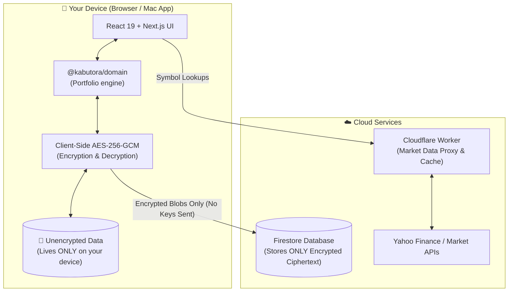
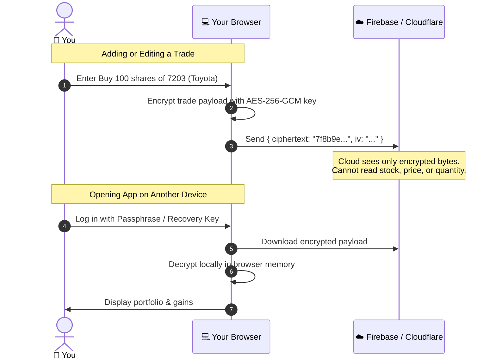

# 🐯 Kabutora (株トラ)

<div align="center">

**A private, fast, and beautiful investment portfolio tracker for Japanese & US markets.**  
*Track TSE stocks, US equities, mutual funds (投資信託), and PTS night trading—without giving away your financial data.*

[](https://nextjs.org/)
[](https://react.dev/)
[](https://www.typescriptlang.org/)
[](https://workers.cloudflare.com/)
[]()
[](https://opensource.org/licenses/MIT)

</div>

---

## Why Kabutora?

Spreadsheets get clumsy as your portfolio grows, and most commercial portfolio trackers either:
1. Don't support Japanese mutual funds (投資信託), NISA accounts, and PTS night sessions properly, or
2. Require you to upload your raw, unencrypted bank and brokerage data to their cloud servers.

**Kabutora** gives you the best of both worlds: a modern, responsive web/mobile app (PWA) with real-time market data, powered by a **zero-knowledge privacy model** where your actual trades and holdings are encrypted right in your browser.



---

## Highlights

### 📈 Multi-Market & Asset Support
- **Tokyo Stock Exchange (東証)**: Real-time prices, day charts, and historical tracking for Japanese equities.
- **US Equities & ETFs**: NASDAQ / NYSE stocks with automatic, real-time USD/JPY currency conversion.
- **Investment Trusts (投資信託)**: Mutual fund NAV tracking with standard 10,000-unit pricing.
- **PTS Night & Off-Hours (JNX)**: Track after-hours evening trading prices alongside daytime sessions.
- **Major Benchmarks**: Nikkei 225, TOPIX, S&P 500, NASDAQ Composite, Dow Jones, and USD/JPY FX.

### 🛡️ Real Zero-Knowledge Privacy
- **End-to-End Client Encryption**: All trade amounts, shares, dates, and account names are encrypted with AES-256-GCM on your device before syncing.
- **No Cloud Visibility**: Even if someone gained access to the cloud database, they only see random encrypted gibberish. The server never holds your keys.
- **Automated Privacy Testing**: Built-in verification scripts inspect build bundles to guarantee zero unencrypted data leaks.



### 🧮 Precise Financial Math
- **Tax-Aware Accounts**: Track NISA (成長投資枠・つみたて投資枠), 特定口座, and 一般口座 in one clean dashboard.
- **Stock Splits Done Right**: Every trade is converted once into today's share units using the split list that came with the split-adjusted prices, so a split can never be applied twice. The ledger marks adjusted rows (`分割 ×3`).
- **Moving-Average Cost (移動平均法)**: Per broker and account type, like Japanese brokerage statements.
- **Fast Charts**: 1D, 1W, 1M, 3M, YTD and All-Time portfolio curves computed on the device in milliseconds.

### 📱 Built for Mobile & Desktop
- **Fast & Responsive**: Feels like a native iOS/Android app with gesture navigation and pull-to-refresh.
- **Offline Ready**: Instant loading with IndexedDB caching and Service Worker support.
- **Theme Options**: Dark and Light themes with customizable accent colors (Graphite, Blue, Forest, Plum).

---

## Project Structure

Kabutora is organized as a clean TypeScript monorepo using `pnpm`:

```
株トラ/
├── apps/
│   └── web/                   # Next.js 15 App Router & Cloudflare edge integration
│       ├── app/               # Application shell & authenticated market API routes
│       ├── components/        # UI by feature: app/, dashboard/ (coordinator + hooks + views), watchlist/, search/, charts/
│       └── lib/               # charts/ market/ portfolio/ sync/ vault/ ui/ — and edge-only server/
├── packages/
│   └── domain/                # Pure TypeScript portfolio engine (positions, splits, history, dividends)
├── firebase/                  # Security rules and database index definitions
├── docs/                      # Architecture map, specifications, and security model
└── scripts/                   # Native app builders (macOS / iOS Preview) & privacy verifiers
```

---

## Getting Started

### 1. Prerequisites
- **Node.js**: 20.x or newer
- **pnpm**: 11.x

### 2. Clone & Install
```bash
# Clone the repository
git clone https://github.com/SotaYanagisawa/kabutora.git
cd kabutora

# Install dependencies
pnpm install
```

### 3. Run Locally
```bash
pnpm dev
```
Open [http://localhost:3000](http://localhost:3000) to see your portfolio in local demo mode.

---

## Testing & Quality Checks

Kabutora includes full unit test coverage across accounting, crypto, and market logic:

```bash
# Check TypeScript and run all unit tests (including market performance contracts)
pnpm check

# Run the real Worker + Durable Object market backend with latency budgets
pnpm test:worker

# Verify that no private data is present in builds
pnpm verify:privacy

# Check the live market providers still parse (needs network)
pnpm check:live

# Verify the deployed site, auth and market freshness
pnpm verify:prod

# Production Next.js build
pnpm build

# Cloudflare Workers build
pnpm --filter @kabutora/web build:cloudflare
```

---

## Deploying to Cloudflare Workers

Kabutora is built to deploy globally on Cloudflare Workers in seconds using **OpenNext**:

```bash
# Build and deploy to your Cloudflare Worker
pnpm --filter @kabutora/web deploy:cloudflare
```

For complete cloud configuration details, including Firebase authentication and security rules, see the [Cloud Deployment Guide](docs/cloud-deployment.md).

---

## Documentation

- 🧭 [Codebase Path Map](docs/path-and-nodes.md) — Fast routing from a change to its owning module and test
- 📐 [Architecture & Data Flow](docs/architecture.md) — System design and data flow
- 🧮 [Calculation Rules](docs/calculation-rules.md) — Exact formulas for splits, moving-average cost, FX, dividends and history
- ☁️ [Cloud Deployment Guide](docs/cloud-deployment.md) — Firebase and Cloudflare step-by-step setup
- 📡 [Market Backend](docs/market-backend.md) — How prices are fetched, cached, kept private and tested
- 🔒 [Threat Model & Security](docs/threat-model.md) — Security boundaries and encryption specifications

---

## License

Kabutora is intended to be released under the MIT License (a `LICENSE` file has not been added yet).
