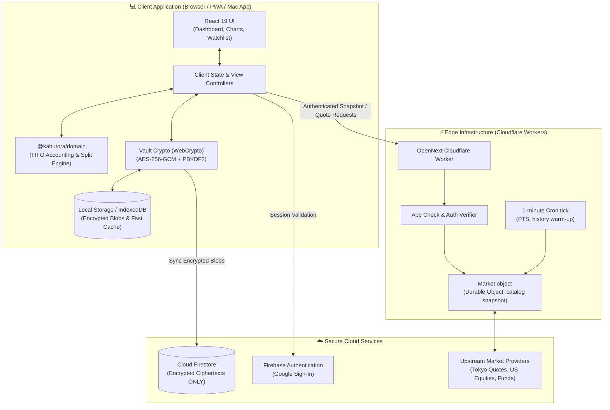
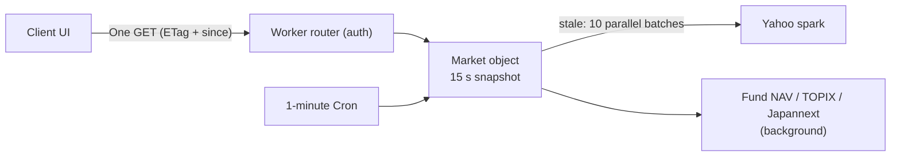

# System Architecture & Design

Kabutora is designed around a core principle: **financial ledger data belongs entirely to the user**. The system operates as an event-sourced portfolio engine where all holdings, gains, and performance curves are reconstructed on-the-fly inside the client's browser.

---

## 1. System Overview

---

## 2. Core Modules & Packages

| Package / Directory | Role | Description |
|---|---|---|
| [`apps/web`](../apps/web) | **Web App & API** | Next.js 15 App Router application, responsive UI components, Lightweight Charts, and Cloudflare OpenNext entrypoint. |
| [`packages/domain`](../packages/domain) | **Domain Logic** | Pure TypeScript accounting engine. Calculates FIFO cost basis, average cost lots, corporate actions (splits/reverse splits), and multi-currency values with `Decimal.js`. |
| [`firebase`](../firebase) | **Security Rules** | Firestore security rules enforcing user ownership and rejecting unauthenticated or malformed writes. |
| [`scripts`](../scripts) | **Tooling** | Native macOS wrapper and iPhone preview packagers, privacy boundary verification scripts. |

---

## 3. Runtime Modes

### A. Local Mode (macOS App)
- **Zero Cloud Footprint**: Runs completely offline without needing cloud services.
- **Keychain Storage**: Portfolio data is encrypted using AES-256-GCM and stored in `~/Library/Application Support/株トラ/local-vault.json`.
- **Hardware-Protected Keys**: The 256-bit encryption key is managed by macOS Login Keychain.

### B. Cloud Mode (PWA Sync)
- **Multi-Device Access**: Syncs seamlessly between Mac, iPhone, and other devices.
- **Encrypted Payloads**: Only encrypted ciphertext documents are stored in Cloud Firestore.
- **Client-Side Decryption**: Decryption keys never leave device memory.

---

## 4. Market Data Pipeline

- **One request for prices**: quotes, benchmarks and five days of intraday bars for the whole shared catalog (max 200 symbols) arrive in one response, refreshed on read when older than 15 seconds.
- **Historical Daily Bars**: Stored per symbol and year in the market object; the client requests the catalog from its earliest needed year and filters locally.
- **Caching**: The object keeps the snapshot in memory and SQLite; the client keeps the last snapshot in IndexedDB so a reopened app renders instantly and revalidates with an ETag.
- **Privacy Split**: Market requests carry no holdings; Firestore portfolio documents remain ciphertext and are decrypted only in the client.
- See [Market backend](market-backend.md) for budgets and checks.
- **Search isolation**: Search keystrokes stay inside a small component, local matches render immediately, obsolete provider requests are aborted, and the server applies a bounded provider deadline.
