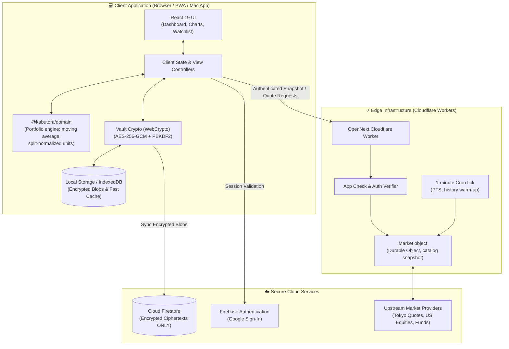
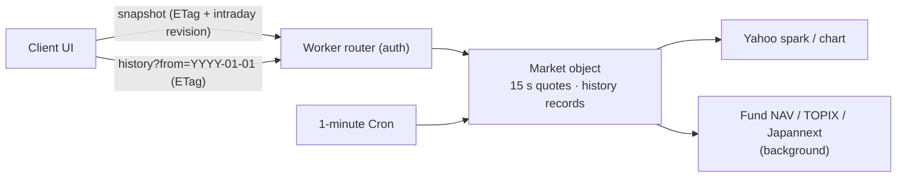

# System Architecture & Design

Kabutora is designed around a core principle: **financial ledger data belongs entirely to the user**. The system operates as an event-sourced portfolio engine where all holdings, gains, and performance curves are reconstructed on-the-fly inside the client's browser.

---

## 1. System Overview

---

## 2. Core Modules & Packages

| Package / Directory | Role | Description |
|---|---|---|
| [`apps/web`](../apps/web) | **Web App & API** | Next.js 15 App Router application, responsive UI components, Lightweight Charts, and Cloudflare OpenNext entrypoint. |
| [`packages/domain`](../packages/domain) | **Portfolio Engine** | Pure TypeScript, no dependencies. Converts every trade once into today's share units (split-normalized), keeps moving-average cost per account group, and derives valuation, history, dividends and notifications. See [calculation rules](calculation-rules.md). |
| [`firebase`](../firebase) | **Security Rules** | Firestore security rules enforcing user ownership and rejecting unauthenticated or malformed writes. |
| [`scripts`](../scripts) | **Tooling** | Native macOS wrapper and iPhone preview packagers, privacy boundary verification scripts. |

---

## 3. Runtime Modes

### A. Local Mode (macOS App)
- **Zero Cloud Footprint**: Runs completely offline without needing cloud services.
- **Keychain Storage**: Portfolio data is encrypted using AES-256-GCM and stored in `~/Library/Application Support/株トラ/local-vault.json`.
- **Hardware-Protected Keys**: The 256-bit encryption key is managed by macOS Login Keychain.

### B. Cloud Mode (PWA Sync)
- **Multi-Device Access**: Syncs seamlessly between Mac, iPhone, and other devices.
- **Encrypted Payloads**: Only encrypted ciphertext documents are stored in Cloud Firestore.
- **Client-Side Decryption**: Decryption keys never leave device memory.

---

## 4. Market Data Pipeline

- **Prices:** quotes, benchmarks and 15-minute series for the whole shared catalog (max 200 symbols) in one response, refreshed on read when older than 15 seconds. Unchanged intraday series are not resent.
- **History:** one record per security with split-adjusted closes, splits and dividends from one upstream response. The client refetches only when the snapshot reports a new history revision.
- **Engine:** the browser computes everything synchronously from the ledger and these records (a few milliseconds), so filters and currencies switch instantly without requests.
- **Caching:** the object keeps data in memory and SQLite; the browser keeps the last snapshot and history in localStorage so a reopened app renders prices on the first frame.
- **Privacy split:** market requests carry no holdings; Firestore portfolio documents remain ciphertext and are decrypted only in the client.
- See [Market backend](market-backend.md) for budgets and checks.
