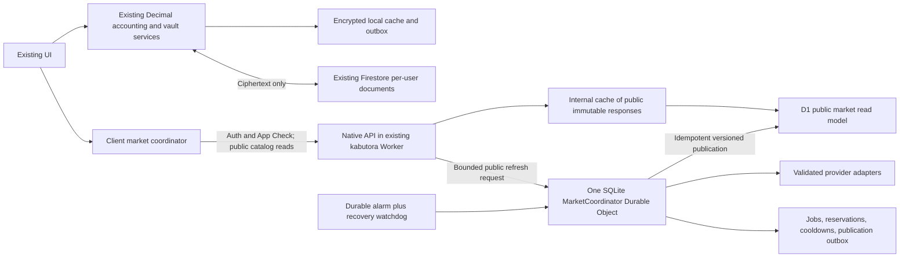

# Kabutora backend overhaul implementation plan

Audit date: October 1, 2026, America/Indianapolis. Requested scale: **a small private group with multiple accounts**. This is an implementation plan; no application code, user data, infrastructure, or production settings were changed during the audit.

Rebuild the market backend around a small authenticated read API, one durable ingestion coordinator, independently testable provider adapters, and a versioned public market store. Keep the existing `kabutora` Worker, OpenNext frontend, Firebase identities, encrypted Firestore portfolios, and client accounting engine. Replace the backend internals in stages behind compatibility adapters, preserving the existing UI and data contracts until their replacements pass the migration gates.

The recommended ingestion coordinator is a **SQLite-backed Cloudflare Durable Object**, exported by the existing Worker. It replaces the current distributed scheduling/claim/queue machinery after cutover. Ordinary market reads bypass this object and serve prepared data. This gives ingestion durable coordination and an appropriate execution budget without requiring a paid server.

Two constraints must be explicit: free infrastructure has hard limits and no project-specific uptime guarantee; reliable access to cached data is different from guaranteed fresh market prices. This audit did **not** establish a free, permitted, reliable feed covering every current asset class for multiple users. Feed permission, coverage, and quota validation are release gates, not assumptions to hide in implementation.

## 1. Audit baseline and findings

The audited checkout is `codex/fix-market-price-refresh`, at HEAD `5164b1e`, **including its existing uncommitted work**. At audit start, 14 tracked files were modified, and `server-auth.test.ts` and migration `0007_market_pts_indexes.sql` were untracked. Preserve those changes. Existing documents describe earlier implementations and sometimes disagree with current code; source and executed checks take precedence.

“Reproduced” below means a local synthetic-data reproduction using current source functions. It does not mean production traffic or private portfolios were inspected.

| Priority | Finding and evidence | Required result |
|---|---|---|
| P0 | **A background path can reintroduce a usable cloud vault key and invalidate recovery.** [portfolio-session.ts](../apps/web/lib/portfolio-session.ts), lines 218 and 229–280, calls `syncGoogleAccountAccess` during replay without excluding v2. It can write `rawKey`, or generate a replacement vault retaining the old `keyId`. [portfolio-cloud-store.ts](../apps/web/lib/portfolio-cloud-store.ts) persists `encodedKey`; [firestore.rules](../firebase/firestore.rules) permits this. The rules test even expects a key write after v2 activation. A synthetic reconstruction of the replacement branch confirmed the uploaded account key decrypts the replacement while the previous recovery key fails. | Remove automatic key upload/replacement before a wider rollout. Preserve readable existing data and recovery material. Never rotate a data key under the same generation ID. Add tests that forbid these operations after v2 activation. |
| P1 | **Valid intraday responses are rejected.** [intraday route](../apps/web/app/api/market/intraday/route.ts) returns `bars` containing `timestamp` and `price`. [market-payload-validation.ts](../apps/web/lib/market-payload-validation.ts), lines 12–14, validates `bars` as daily history requiring `date` and `close`. Both intraday loaders use this validator through [market-api-response.ts](../apps/web/lib/market-api-response.ts). Reproduced: daily response accepted; valid intraday HTTP 200 rejected. | Resource-specific runtime schemas shared by producer and consumer; test real route-shaped responses end to end. |
| P1 | **Valid request sizes can exceed D1's bind limit.** [server-market-store.ts](../apps/web/lib/server-market-store.ts), lines 27–42 and 202–212, expands each US symbol into seven variants. Reproduced: 20 accepted symbols become 140 SQL parameters. History action and distribution reads also expand aliases without consistently rechunking. D1 allows 100 bindings per query. [D1 limits](https://developers.cloudflare.com/d1/platform/limits/). | Resolve aliases once to canonical instruments; cap SQL parameters after expansion, including other bound values. Test 14, 15, 20, 50, and maximum accepted request sizes against the Worker database runtime. |
| P1 | **Freshly fetched old data can replace newer market observations.** [market-snapshot-merge.ts](../apps/web/lib/market-snapshot-merge.ts), lines 8–12, accepts a newer `fetchedAt` independently of market time. Quote persistence also orders by fetch time. Reproduced: an older observation fetched later overwrites a newer price. | Compare observation time, validation, session, source authority, and correction revision explicitly. Separate successful checking from new market data. |
| P1 | **ETags miss meaningful changes.** [server-market-response-cache.ts](../apps/web/lib/server-market-response-cache.ts), lines 7–9, derives the compact ETag from quote timestamps and counts. Reproduced: a benchmark-only change keeps the same ETag. [server-market-store.ts](../apps/web/lib/server-market-store.ts), lines 487–491, also compares benchmark JSON `price`/`change`, while [ServerBenchmark](../apps/web/lib/server-market-types.ts) uses `value`/`changeRatio`. | Content revisions must include every delivered dataset. Same-timestamp corrections and benchmark-only updates must persist and invalidate correctly. |
| P1 | **The fast read path disappears when refresh is late.** [server-market-response-cache.ts](../apps/web/lib/server-market-response-cache.ts), lines 53–56, rejects prepared data after 15 minutes. The [snapshot route](../apps/web/app/api/market/snapshot/route.ts) then calls `readMarketSnapshot`, which reads and reconciles registry-wide quotes and, for full responses, PTS frames and intraday history. | Keep validated last-known-good snapshots available with explicit age. Request handlers must not reconstruct charts, repair history, or contact price providers on a cache miss. |
| P1 | **A completed refresh is not reliably observable.** Quote jobs can skip publishing for eight minutes in [worker-entry.ts](../apps/web/worker-entry.ts). [refreshQueuedMarketData](../apps/web/lib/client-market-service.ts) polls for 30 seconds and defines completion as every quote acquiring a later `fetchedAt`; unchanged quotes deliberately do not update their D1 row. Run status is marked complete at dispatch in [server-market-scheduler.ts](../apps/web/lib/server-market-scheduler.ts), before consumption. | Durable job states and `lastSuccessfulCheckAt` distinguish “checked, unchanged,” “published,” “partial,” “queued,” and “budget deferred.” Publish each completed public data generation promptly. |
| P1 | **Quota control has bypasses and races.** [quotes](../apps/web/app/api/market/quotes/route.ts), [benchmarks](../apps/web/app/api/market/benchmarks/route.ts), [history](../apps/web/app/api/market/history/route.ts), [distributions](../apps/web/app/api/market/distributions/route.ts), and intraday recovery still call providers in HTTP requests. Dispatch checks usage before enqueue but increments its counter during consumption. Provider accounting often counts securities rather than actual outbound calls, fallbacks, and canaries. | One admission path for all upstream work, durable reservations, real outbound-attempt accounting, bounded repair jobs, and no unbudgeted HTTP fallbacks. |
| P1 | **Scheduling correctness depends on loosely coupled state.** Claims are written before queue publication; no transaction spans those operations. Claim IDs contain an entire batch's IDs, so regrouping can permit duplicate work for a symbol. Provider cooldowns are largely isolate-local despite an existing cooldown table. | Per-resource durable job identities, restart-safe publication, provider-wide circuit breakers, and fair priority scheduling. |
| P1 | **The current authorization is not ready for the requested group.** [server-auth.ts](../apps/web/lib/server-auth.ts), lines 76–77, permits exactly one `KABUTORA_ALLOWED_UID`; Firestore instead uses per-user `appAccess` documents. Authentication dependency failures become generic 401s. Certificate fetching lacks an explicit deadline and refresh-on-new-key handling. | Multiple explicitly approved members, consistent membership configuration, bounded key discovery, stable auth/dependency error codes, and cross-account denial tests. |
| P1 | **Market requests reveal more than the schema scanner proves.** [dashboard.tsx](../apps/web/components/dashboard.tsx), around line 1395, derives quote IDs from holdings/watchlists; intraday requests put those IDs in URLs. History requirements can reflect private transaction dates. Authentication and a symbol list coexist at the edge even if no UID column is stored. | Remove automatic holdings-derived lists and private history dates from cloud requests. Use common public catalog partitions for background reads; keep search separate. Do not describe this as anonymous market access. |
| P1 validation gate | **Large sync cleanup batches need real security-rule coverage.** [portfolio-cloud-store.ts](../apps/web/lib/portfolio-cloud-store.ts) cleans up 200 events per transaction. Each delete checks its receipt with `getAfter`. Firestore permits only 20 document-access calls for a transaction, subject to caching; these per-event receipt paths are distinct. Existing store tests mock transactions. [Firestore limits](https://firebase.google.com/docs/firestore/quotas). | Reproduce with the emulator, use a proven safe chunk size, and resume cleanup without losing events. Treat this as a concrete implementation risk, not an executed production failure. |
| P2 | **Startup, caching, and monitoring remain fragmented.** The cloud root requests a full snapshot, dashboard startup may also fetch quotes/benchmarks, history/distribution recovery has its own paths, and many persistence failures are swallowed. Provider conversion code still contains native-number financial arithmetic. [cloud-portfolio-app.tsx](../apps/web/components/cloud-portfolio-app.tsx), [dashboard.tsx](../apps/web/components/dashboard.tsx), [server-market-provider.ts](../apps/web/lib/server-market-provider.ts). | One client data coordinator, independent loading states, structured failure reporting, and Decimal-based financial normalization. |

The current server batching constant is **8**, not the 20 quoted in some documentation. A successful unit suite is not proof that these request, database, encryption, or quota boundaries work together.

Cloudflare began enforcing D1 Free daily read/write limits on **September 1, 2026**. Exceeding them prevents queries until reset. This is a plausible contributor to the reported outages, but production metrics were not inspected, so it is not an established incident diagnosis. [Cloudflare enforcement notice](https://developers.cloudflare.com/changelog/post/2026-09-01-d1-free-tier-limit-enforcement/).

## 2. Scope and non-negotiable data preservation

Rebuild provider acquisition, normalization, scheduling, retries, persistence, publishing, market APIs, client data orchestration, and operational visibility. Harden encrypted sync where the audit found defects. Preserve dashboard visuals, controls, settings, navigation, search, JP/US/global securities, fund NAVs, PTS, charts, benchmarks, FX, dividends, corporate actions, imports, exports, local mode, and offline behavior.

Keep Firebase project, UIDs, document paths, portfolio/account/transaction/security IDs, Decimal strings, preferences, pending event IDs, receipts, encryption envelope formats, AAD, recovery formats, and local vault compatibility. The existing domain engine remains the accounting authority in the browser. New internal market IDs must map to existing user security IDs; they must not rewrite portfolio records.

For the market cutover, **no portfolio migration is required**. Firestore and device storage remain in place. No reset, reseed, clearing IndexedDB, dropping receipts, or “delete and sign in again” procedure is acceptable.

The key-upload defect is handled separately from the market rewrite:

1. Stop automatic key upload and automatic envelope replacement; preserve existing legacy reads so users retain access.
2. Preserve existing envelope/key/recovery relationships until a user has successfully unlocked and verified a recovery-capable replacement locally. Merely deleting a legacy cloud key first can lock the owner out.
3. For any previously exposed key, future coordinated recovery enrollment must rotate the actual data key with a new generation, reconcile remote and pending events, verify the new envelope locally, then activate atomically. Rewrapping an exposed key alone does not restore confidentiality.
4. Compare the full decoded portfolio and replayed pending events before/after on the owner's device. Keep fingerprints and financial totals local; do not upload them as telemetry.
5. Never restore a client that can recreate cloud keys or understands only the previous generation after an upgrade. Security-safe rollback versions must be prepared first.

Existing v1/legacy vaults must not be relabeled zero-knowledge. The code inspection establishes an unsafe path; it does not establish which production accounts have executed it. Determine account-specific remediation through a private owner-side diagnostic during implementation.

## 3. Target architecture



Keep HTML, CSP, same-origin Firebase redirect handling, static assets, service worker, and deterministic build ID on the current Cloudflare/OpenNext configuration. The new server modules go under `apps/web/lib/server/market/`; they are excluded from all client dependency graphs. Expand `packages/market-data` into the framework-independent contract package. Keep old exports and endpoint shapes through adapters while old clients remain supported.

Suggested module ownership:

| Proposed location | Responsibility |
|---|---|
| `packages/market-data/src/contracts/` | Versioned request/response schemas, quote/history/intraday types, failure codes, provider capabilities |
| `apps/web/lib/server/market/api/` | Authentication, membership, body limits, validation, response streaming, compatibility routes |
| `apps/web/lib/server/market/coordinator/` | Durable job state, one alarm schedule, priority queue, budgets, retries, circuit breakers |
| `apps/web/lib/server/market/providers/` | One adapter per upstream with no database or portfolio dependencies |
| `apps/web/lib/server/market/storage/` | Parameter-bounded D1 queries, additive migrations, versioned public records |
| `apps/web/lib/server/market/publisher/` | Build immutable response chunks and atomically advance their manifest |
| `apps/web/lib/market-client/` | One transport/cache/loading coordinator consumed by existing UI adapters |
| Existing `portfolio-*` and `vault-*` services | Preserve encrypted data contracts; repair security and lifecycle defects with dedicated tests |

SQLite Durable Objects are available on Workers Free and document a default 30-second CPU allowance per invocation. Ordinary Workers Free HTTP and Cron invocations have a 10 ms CPU allowance. Thus moving expensive parsing into a normal queue is not, by itself, an adequate CPU strategy. Measure the actual deployed configuration during the initial feasibility test. [Durable Object limits](https://developers.cloudflare.com/durable-objects/platform/limits/), [Workers limits](https://developers.cloudflare.com/workers/platform/limits/).

Use **one shared coordinator instance initially**, not one per member, security, or provider. It has no user portfolio state. Cached reads do not depend on its latency or availability. Add its binding and SQLite class migration to the existing Worker's configuration; this does not create a second hosting project. Remove old queue consumers and duplicate Cron work only after controlled draining and cutover.

## 4. Data aggregation and provider design

Define one adapter contract with independent capabilities for quotes, intraday, daily history, dividends, splits, FX, search, calendars, and instrument metadata. A quote refresh must not fetch company names, decades of history, or dividend history as a side effect. Group requests only where the provider actually supports a batch endpoint.

Every normalized observation carries canonical instrument/venue/currency, resource kind, provider and parser version, observation time, successful-fetch time, last-checked time, published revision, delay classification, and validation result. Financial values remain decimal strings with `Decimal` calculations. Display adapters may convert to numbers.

| Coverage to retain | Current source family | Replacement policy and release gate |
|---|---|---|
| JP equities and ETFs | Yahoo chart and Yahoo Japan HTML | Isolate adapters and characterize exact coverage. A permitted structured source is preferred; no new group deployment may assume a public page grants automated retrieval or redistribution rights. |
| US and global quotes/history | Yahoo batch/chart; CNBC quote fallback | A Yahoo hostname change is not independent redundancy. Separate per-provider health and validate exchange, currency, delay, and session. CNBC quotes do not substitute for missing historical bars. |
| JP fund NAV/history/distributions | Yahoo Japan page/token/history endpoints; selected issuer data | Separate daily NAV from history and distributions. Bound page/chunk count and token renewal. Prefer documented issuer data where available and permitted; do not infer successful “no dividends” from an empty or changed page. |
| Foreign fund | Existing Monex adapter | Preserve its instrument identity and NAV unit. Verify retrieval permission and coverage; report gaps rather than substituting a different fund. |
| JP PTS | Japannext public batch | Retain efficient batched collection and inert parsing. Preserve venue/trading date, observed time, and source update time. Verify automated and multi-user use before enabling the new adapter. |
| FX and benchmarks | Current Yahoo sources and fallbacks | Independent capabilities and storage revisions; a missing FX rate must never silently become 1. Preserve the current benchmark set. |
| Search | Embedded catalogs plus remote search | Immediate local results, debounced/cancellable remote work, short deadlines, bounded caches. Search terms must not be persisted or logged. |

Do not select a provider only because it advertises a free API. J-Quants Free supplies two years of data with a 12-week delay, and its FAQ restricts sharing viewable data with others; it is not a substitute for this group's current quotes. Alpha Vantage's standard free allowance is 25 requests/day, with current/delayed US quote access subject to paid entitlements. Twelve Data lists 8 credits/minute and 800/day on its individual free plan; sharing entitlements need separate verification. [J-Quants plans and FAQ](https://jpx-jquants.com/en), [Alpha Vantage support](https://www.alphavantage.co/support/), [Twelve Data pricing](https://twelvedata.com/pricing).

Yahoo's published terms restrict automated collection without permission. Existing access working technically is not evidence of permission or a stability commitment. Record applicable terms, caching/retention/display rights, supported symbols, delay, and request allowance for each candidate before selecting it. Do not pool individual API keys to evade quotas or distribution restrictions. [Yahoo terms](https://legal.yahoo.com/us/en/yahoo/terms/otos/index.html).

**Feasibility decision:** keep every current product capability in the implementation checklist. If an asset class cannot obtain suitable free access, mark the full-coverage $0 requirement unresolved before broad cutover. Do not silently remove that feature, purchase a subscription, or label stale data live. Infrastructure work can proceed while source eligibility is resolved; full completion cannot be claimed without it.

Data-quality requirements:

- Validate schema, decimal ranges, timestamps, venue, currency, NAV units, source delay, and corporate-action semantics before persistence. Keep the last valid observation when an update fails validation.
- Select quotes by market time and explicit source precedence. Handle same-time corrections with a revision. Fetch time alone cannot make an older price win.
- Distinguish raw close, split-adjusted close, and total-return-adjusted series. Never apply splits or distributions twice. Preserve manual user corrections inside the encrypted user data.
- Use exchange calendars, holidays, half-days, DST, and PTS sessions crossing midnight. Do not infer missing history solely from calendar-day gaps or a weekday clock.
- Bound each fetch by deadline, allowed host/redirect targets, response bytes, parsing work, and retry count. Respect `Retry-After`; keep one independently failing resource from invalidating a successful batch.
- Retain parser fixtures covering schema drift, delisted instruments, renamed symbols, illiquid/no-trade sessions, distributions with zero events, and partial history. Canary checks consume the same quotas as other work.

## 5. Durable scheduling, persistence, and caching

**Coordinator state.** Store public job records, durable provider cooldowns, resource coverage, budget reservations, and pending publications in the coordinator's SQLite storage. A stable job key includes instrument/venue, resource, provider/parser version, and time/range bucket. It excludes account IDs and portfolio membership. A refresh of 20 symbols creates or joins those resource jobs; regrouping cannot create a second logical fetch.

States are `queued`, `running` with an expiring lease, `succeeded_changed`, `succeeded_unchanged`, `partial`, `retry_at`, `budget_deferred`, and `failed`. Persist admission and its conservative reservation transactionally. Deduct actual attempts, including redirects and fallback calls, as work proceeds; reserve retry capacity before scheduling it. Budget checks after work has already been accepted are too late.

Use a single durable alarm for the earliest due task in a persisted schedule. Reserve time for PTS and current quotes before metadata/backfills. Each execution takes a bounded slice—initially at most two concurrent fetches, under 20 seconds wall time and under the documented subrequest limit—with a persisted continuation. A short watchdog Cron only checks/rearms missing progress; it does not duplicate acquisition.

Alarms can execute more than once and have finite automatic retries. Make every write idempotent, handle expected failures explicitly with a future retry time, and recover expired leases after object restart. A missed alarm or exhausted automatic retry must not lose the task. [Durable Object alarms](https://developers.cloudflare.com/durable-objects/api/alarms/).

**Publication.** SQLite state and D1 are different transactional systems. Use a durable publication outbox, a deterministic revision, and idempotent D1 writes. Commit the complete public response manifest only after all referenced chunks are durable. If D1 committed but the coordinator crashed before acknowledging it, retrying that revision must be harmless. Never imply an atomic transaction exists across those systems.

**D1 layout.** Add versioned tables alongside the current ones:

| Public data | Storage/retention strategy |
|---|---|
| Instrument catalog and aliases | One canonical instrument per actual listing/venue/currency, with an explicit mapping from every existing ID. Do not collapse distinct listings just because symbols match. |
| Latest quotes and benchmarks | One canonical row each; independent observation and check timestamps; content hash/revision; conditional writes on meaningful changes. |
| Daily history | Bounded instrument/time chunks, starting with monthly or yearly chunks selected by measured size. Read only requested public time buckets; update a short overlap window for corrections. Avoid reparsing an entire multi-decade JSON blob. |
| Intraday | Short session/time chunks. Keep seven days initially, preserving current chart coverage. Retain packed PTS frames or equivalent blocks, not a row per symbol per minute. |
| Corporate actions and distributions | Stable source/event identity, revisions, coverage watermark, and explicit successful-empty versus failed status. Preserve all history needed by current features. |
| Prepared responses | Immutable, bounded public chunks plus a compact manifest. Target at most 256 KiB compressed per chunk and remain below D1's per-value limit. Keep a last-known-good generation through transient failure. |

Index actual queries and inspect query plans plus measured `rows_read`/`rows_written`. Chunk binds after normalization. Run retention cleanup independently of successful provider fetches; the current “delete only at one session minute” pattern can miss cleanup. Keep old tables during the rollback window and account for the temporary doubled storage.

**Read path.** Authenticate before serving cached market data. Use internal cache keys containing only public resource/partition/schema/revision, never auth headers, UIDs, or private query bodies. Stream the prepared representation; do not decode/re-encode or reconcile history in the HTTP handler. Cache eviction is expected, so D1 remains the origin. Edge cache is a latency optimization, not the only durable copy.

Compute ETags from immutable content revisions that include quotes, benchmarks, intraday, actions, and coverage as appropriate. Send current server time in response headers; keep publication time distinct from current time. A 304 must still let the client update its trusted clock. Keep mutable job/progress metadata separate from the price representation so unchanged prices do not produce endless payload churn.

An absent or stale chunk returns usable cached data plus status or a bounded pending/unavailable response. It never starts synchronous upstream fetching. Publish successful batches without the current eight-minute suppression. Unchanged provider data still advances the resource's successful-check status.

## 6. API, privacy, and multi-account security

Introduce versioned contracts internally, exposed through the existing same-origin market route namespace. Keep v1 adapters during rollout; old clients receive the same required fields and stable errors. Every route uses strict runtime schemas with byte, count, date-range, string-length, and unknown-field limits. Protect both native Worker routing and the local Next.js adapter with the same contract tests.

| API operation | Required behavior |
|---|---|
| Bootstrap/snapshot | Compact catalog-wide quotes, benchmarks, immutable revision, and coverage first; charts and history load independently. |
| Intraday | Dedicated intraday schema, bounded cursor/time partition, explicit session coverage. Do not infer success from “any bar returned.” |
| History/distributions | Cached public range chunks and coverage; missing chunks admit background jobs and return partial/pending state without losing existing data. |
| Refresh | Validate, coalesce, reserve, and acknowledge accepted work. Return rejected/deferred resources explicitly; never silently truncate an oversized request. |
| Refresh status | Report actual execution and publication state, including successful unchanged data. Store only public job IDs/state; do not maintain a user-to-symbol job ledger. |
| Search | Local catalog first; bounded lookup with transient query text and typed partial results. |
| Health/readiness | Minimal public liveness; authenticated operational readiness includes binding/schema/revision/last-progress checks, without portfolio information or detailed provider payloads. |

**Membership.** Replace the one-UID comparison with a small explicit allowlist. Keep Firebase identity and App Check verification on every protected route. Use a versioned operator-managed membership configuration to apply the same member set to Worker authorization and Firestore `appAccess`; deployment tooling verifies parity. A small group does not need an extra identity service or an additional Firestore read on every market request. Fail closed during disagreement. Test joining, revocation, account switching, and mixed old/new clients. Revocation must disable edge access before any cleanup, and must never delete a portfolio.

**Token verification.** Deduplicate certificate discovery, set deadlines, refresh once on an unfamiliar key ID, enforce issuer/audience/algorithm/expiry/app identity, and cache verified public keys only within their validity policy. Differentiate invalid credentials, denied membership, App Check failure, and unavailable verification dependencies. Allow at most one explicit client token-refresh retry for a credential expiry; never create a 401 retry loop or bypass verification during an outage.

**Portfolio confidentiality.** No holdings-derived lists, transaction dates, amounts, positions, account/broker IDs, financial totals, or usable keys go to market services, their jobs, or their logs. For automatic data access, every member uses the same public catalog partitions and standard time buckets; filter and calculate against the private portfolio locally. Replace automatic holding-derived registry registration with public catalog management. Keep user security IDs unchanged through local mappings.

An explicit search or instrument lookup remains a public query visible transiently to the authenticated service; it must not be persisted as holdings or search history. The service can still observe identity, IP, access time, and requested public content. The design protects the encrypted ledger and removes automatic portfolio disclosure; it does not claim traffic anonymity. Do not put symbols or search terms in URLs. Broad arbitrary-instrument coverage under a fixed free catalog still requires the provider/admission feasibility gate above.

**Abuse protection.** Use short-window edge limits and body caps, then globally reserved upstream budgets in the coordinator. Edge rate limiting is approximate and cannot replace accounting. Limit member refresh frequency using an auth-only opaque key with no attached symbol list, and bound global catalog growth. Never cache authorization results into a publicly accessible route. [Cloudflare rate-limit behavior](https://developers.cloudflare.com/workers/runtime-apis/bindings/rate-limit/).

**Logs and browser boundary.** Log only allowlisted error code, route template, build/schema/parser version, timings, counts, and quota/progress metrics. No request bodies, full URLs, Firebase tokens, cookies, ciphertext, keys, or user-associated securities. Keep CSP/nonces, local-only bootstrap restrictions, service-worker cache isolation, and client/edge import checks. Extend privacy checks to dynamic synthetic request/queue/log capture; column-name regexes alone cannot establish confidentiality.

Verify actual Firebase App Check registration and Firestore enforcement, deployed rules, authorized domains, build-time configuration, dependency advisories, and least-privilege deployment credentials. These settings were not audited live. Keep provider/API secrets server-only and preserve the current working authentication provider until a replacement is tested; a configuration cleanup must not repeat an authentication outage.

## 7. Client loading and encrypted sync

The visual UI stays intact. Replace its competing market-loading effects with one client service owning cancellation, in-flight request sharing, cache revision, retries, and refresh state. Components keep their current props through adapters.

- Restore the trusted device's verified encrypted portfolio and cached public quotes immediately. Authenticate and revalidate independently; provider outages must not block viewing an already available portfolio.
- Load one compact market snapshot before optional chart detail. Lazy-load history/distributions needed by a view without delaying the quote result or navigation.
- Keep the last valid data visible while new work is queued or fails. Map pending/partial/stale/limited states onto existing controls and status UI without reporting an uncompleted update as successful.
- Use a deadline covering auth acquisition plus network plus decoding. Cancel obsolete view work, pause polls when hidden, apply jitter/backoff, and bound cross-tab duplicate work. Retain user update-frequency settings while explaining actual source timestamps through existing freshness indicators.
- Keep public caches versioned, size-bounded, and separate from user state. Shared-device mode must not create persistent private caches or persist usable keys.

Keep the Firestore encrypted event model, outbox, receipts, and compaction protocol. Repair lifecycle issues rather than replacing Firestore or designing new cryptography. Reconnect, revocation, quota exhaustion, failed compaction, obsolete-generation events, and late transaction completion all need explicit states.

Prototype receipt cleanup with small chunks (for example eight events), then establish the safe rule-access bound in the emulator. Persist a resumable checkpoint; never delete events until a committed encrypted snapshot incorporates them. Preserve deduplication receipts and applied-event information; no retention change is allowed without proof that old devices cannot replay deleted history.

A cloud save is acknowledged only after server confirmation. A trusted-device offline save is acknowledged as locally durable only after the encrypted outbox transaction commits. Memory-only saves remain visibly pending. A timeout can have an ambiguous server outcome, so retries use the same immutable event ID and receipt checks. Do not discard pending changes to clear a retry loop.

Add envelope-size and outbox-growth diagnostics before hitting Firestore's document limits. Large existing portfolios must retain their data and have a recoverable failure/export path; do not silently split, truncate, or change envelope formats as part of this market rewrite.

## 8. Free-tier envelope and performance targets

Initial sizing assumption, to be validated rather than imposed on existing data: **up to 10 invited accounts, three devices each, 10 concurrently active devices, and 200 distinct actively refreshed public instruments across the group**. Historical or private portfolio record counts are not truncated to meet that number. Aggregate provider acquisition is independent of member count; HTTP and encrypted sync traffic are not.

| Resource | Current documented free allowance | Proposed operating ceiling |
|---|---|---|
| Workers | 100,000 requests/day; 10 ms HTTP/Cron CPU | 50,000 requests/day including dynamic frontend, APIs, watchdog, and transition overhead; cached API p99 CPU below 8 ms |
| D1 | 5 million rows read/day, 100,000 written/day; 500 MB per Free database, 5 GB total | 2 million reads/day, 60,000 writes/day, 300 MB steady state and under 450 MB during migration |
| SQLite Durable Object compute | 100,000 requests/day; 13,000 GB-s/day | 20,000 requests/day; 8,000 GB-s/day across all application objects; one market coordinator initially |
| SQLite Durable Object storage | 5 million rows read/day, 100,000 written/day, 5 GB total | 1 million reads/day, 40,000 writes/day, under 100 MB for bounded jobs/control state |
| Existing Queue during transition | 10,000 operations/day; 24-hour retention | Under 8,000 operations/day including reads, deletes, retries, and any dead-letter writes; drain and remove it after cutover |
| Firestore | 50,000 reads/day, 20,000 writes/day, 20,000 deletes/day, 1 GiB stored, 10 GiB/month outbound | 20,000 reads/day, 8,000 writes/day, 8,000 deletes/day, 500 MiB stored, 5 GiB/month outbound; preserve all private data if limits approach |
| Providers | Source-specific, including display permission | Separate limits for each source; every acquisition path uses them; no “30,000 calls” assumption substitutes for provider terms |

Limits verified for this plan from [Workers pricing](https://developers.cloudflare.com/workers/platform/pricing/), [D1 pricing](https://developers.cloudflare.com/d1/platform/pricing/), [D1 limits](https://developers.cloudflare.com/d1/platform/limits/), [Durable Object pricing](https://developers.cloudflare.com/durable-objects/platform/pricing/), [Queue pricing](https://developers.cloudflare.com/queues/platform/pricing/), and [Firestore pricing](https://firebase.google.com/docs/firestore/pricing). These are account/project-wide allowances, not independent allowances per member or per service instance. Confirm the actual existing plans and other workloads before implementation; do not silently upgrade or downgrade a billed project.

Example request budget: 10 active devices × 4 hours/day × 60 one-minute checks/hour × two shared streams is 4,800 market requests/day, before startup/history/search and authentication. Compare this with the current per-symbol-batch polling. Example quote workload: 200 instruments × 16 hours × four refreshes/hour is 12,800 instrument checks/day before retries; provider batching and market schedules determine the actual request count. These are planning calculations, not measured production usage.

Measure D1 index-write amplification, PTS cleanup, manifests, migration overlap, DO alarm/storage writes, Firebase rule reads, listener reconnects, and encrypted payload egress. DO duration includes active wall time; slow providers consume duration even when CPU is idle. Avoid permanently active timers, WebSockets, unnecessary object instances, and unbounded backfills. Alarm scheduling and retention deletes also consume storage operations.

Operational metrics must distinguish HTTP availability from source freshness: CPU/latency percentiles, cache hit rate, age of each public dataset, pending-job age, provider error class, last successful alarm/publication, actual database row costs, and encrypted-sync acknowledgement latency without user/financial labels. Set thresholds for absent progress and approaching operating ceilings, and document recovery for a stopped coordinator, unavailable provider, exhausted quota, broken auth exchange, and interrupted migration. Use existing free platform monitoring and an operator runbook; no paid monitoring dependency is required.

At the operating ceiling, defer low-priority metadata/backfill work first and expose a stable `budget_deferred` status. At hard exhaustion, cached views remain usable where available. No automatic paid fallback. Budgets and alerts are not spend caps on a paid plan; the $0 claim requires verified no-cost plans plus admission control. Third-party provider/auth outages or account-wide quota exhaustion can still prevent a first-ever uncached load.

Targets below are acceptance targets, not achieved measurements or an SLA:

| Measure | Initial target and measurement boundary |
|---|---|
| Trusted returning user | Interactive cached portfolio within 2 seconds on the agreed mobile/Safari fixture, without waiting for providers or cloud replay |
| Cached public API read | p95 under 500 ms from US and Japan test locations, p99 under 1.5 seconds; also measure cold auth-key/cache misses separately |
| Refresh acknowledgement | p95 under 500 ms with valid warm auth; pending/failure state resolves within the client deadline rather than hanging |
| Current quote acquisition | Nominal 15-minute cadence for eligible active sources; show actual source delay. Preserve manual refresh as a budgeted early check, not a real-time guarantee |
| NAV/history/events | NAV after the source's daily publication; daily history incremental; distributions according to source capability with explicit coverage |
| PTS | Preserve one-minute collection where permitted and available; distinguish observations from actual trade timestamps and retain visible gaps |
| Reliability | Target 99.9% successful cached reads under the agreed workload while hosting/auth are operational; assess a seven-day soak, then a rolling 30-day window |
| Data durability | Zero loss of server-confirmed events and committed local outbox records during tested upgrade/restart/failure cases; no promise against loss of an unsynced device |

## 9. Implementation sequence and acceptance gates

Rough effort: **five to eight focused engineering weeks**, plus a seven-day soak and any time needed to resolve feed access. Re-estimate after the first phase. The order below is intentional; performance optimizations must not ship ahead of the data-protection repair.

| Phase | Concrete implementation work | Exit gate |
|---|---|---|
| 0. Freeze the baseline and establish evidence | Preserve the existing dirty checkout; identify the deployed version/config/rules separately; inventory endpoints, schema versions and legacy clients; build synthetic fixtures and stage-by-stage timings. Produce owner-controlled encrypted backups including pending events and prove local restore. Confirm actual plans, quotas, dataset sizes, and member count. | Reproducible baseline, rollback artifact, successful restore drill, no private data in measurements. All five local audit reproductions become regression cases. |
| 1. Repair key custody and prove compatibility | Remove automatic `syncGoogleAccountAccess` mutation/upload. Make v2 key-document writes impossible in rules. Preserve safe legacy reads and user-driven migration. Test pending old-device edits and existing recovery keys. Repair intraday schema mismatch and bind-count failure behind current interfaces. | New clients cannot upload usable keys or silently replace recovery protection; existing users can still unlock and replay. Security-safe rollback available. No blanket data deletion. |
| 2. Prove $0 ingestion and define contracts | Prototype one SQLite coordinator on the existing Worker configuration using synthetic/public permitted fixtures; measure CPU, duration, auth overhead, storage, alarm recovery and D1 publication. Complete the provider capability/permission matrix. Define v2 schemas and a v1 compatibility manifest. | Demonstrated free-plan feasibility for the intended load. Every product capability has a permitted source plan or an explicitly unresolved blocker. No advertised all-market guarantee without evidence. |
| 3. Build the new public store and publisher | Add v2 D1 tables/indexes and canonical alias mapping; import existing public snapshots/history in resumable chunks; quarantine malformed data; implement immutable chunks, manifests, ETags, and stale serving. Keep old tables readable. | Public data parity, bounded queries/rows/bytes, no private records touched, successful restart midway through import/publication, old and new reader compatibility. |
| 4. Implement acquisition and coordination | Move provider logic into capability adapters. Add durable scheduling, provider cooldowns, reservations, idempotency, partial retries, per-source backoff, PTS scheduling, and independent history/event backfills. Reuse captured public responses for comparison instead of doubling live provider load. | Provider failure cannot trigger foreground fan-out; no duplicate logical jobs; no budget overshoot under concurrent refresh; changed and unchanged completion are observable; measured quota headroom. |
| 5. Switch APIs and loading services | Implement native v2 read/refresh/status endpoints plus v1 adapters; multi-member authorization; common public catalog requests; shared client cache/transport coordinator. Preserve UI and local-mode interfaces. | Current UI regression matrix passes; no automatic holding-derived lists/transaction dates leave the device; auth remains enforced; intraday/history load independently; cached startup and API latency targets pass. |
| 6. Harden encrypted sync and operations | Establish safe compaction chunks and restart behavior; outbox durability, late commits, account isolation, revocation and stale-device tests; size/quota diagnostics; sanitized error metrics and operational runbooks. | No lost/duplicated events in the fault matrix; emulator security tests deny other members; actual runtime failures are distinguishable from provider, auth, quota, parsing, and local-storage failures. |
| 7. Soak, cut over, and retire old paths | Run old/new public result comparisons within one acquisition budget; cut over data reads by version flag; transfer scheduler ownership with one active producer; drain the old queue; deploy through existing release commands; retain additive schema compatibility and security-safe rollback. Update path map, threat model, scaling and deployment docs. | Seven-day soak includes JP/US sessions, closures and provider failure injection; required gates pass; production HTTP 200 and new assets verified; authenticated group smoke checks pass; user data and offline pending edits reconcile. |

Each phase should be a reviewable change with its own migration/reversal instructions. Do not run old and new independent collectors at full rate during the soak. A public-data copy/normalization job must never read private Firestore paths.

## 10. Verification, deployment, and rollback

Required new checks are cross-boundary checks, not mocks that only mirror implementation:

- Route-to-client contract tests for every resource, including nonempty JP/US intraday, successful-empty distributions, rejected unknown fields, maximum IDs, expired cursors, partial responses, content compression, benchmark-only changes, and 304 responses.
- Worker-runtime integration with real local D1 and SQLite Durable Object storage: actual SQL, bound-parameter limits, additive migrations, duplicate alarms, lease expiry, restart, source-state persistence, and crash between D1 publication and outbox acknowledgement. Local timing does not prove the deployed CPU allowance; measure canary invocations too.
- Fault injection: every provider times out, 401/403/429/5xx, HTML instead of JSON, oversized body, invalid timestamps, stale fallback, schema drift, D1 daily rejection, lost coordinator progress, corrupt cache chunk, and quota reset. The UI must retain valid data and the ledger must remain editable offline where already supported.
- Multi-account/multi-device emulator tests: member A cannot read/write member B's vault, events, keys, receipts or control documents; membership revocation is enforced; v2 raw-key writes fail; 200+ event cleanup completes through safe chunks; retries after ambiguous commit are idempotent.
- Security and privacy tests using synthetic sentinels: inspect outgoing requests, jobs, persisted public rows and logs for financial data and keys. Test public-query allowlists, auth-before-cache, malicious provider redirects, shared-device cleanup, account switching and client/edge import boundaries.
- Financial golden fixtures: identical original portfolios and events produce identical Decimal balances, holdings, realized/unrealized gains and dividend entitlements with equivalent market inputs. Cover stock splits, revised corporate actions, NAV units, currency conversion and missing FX.
- Browser matrix: Chromium/WebKit, desktop/mobile, plus authenticated physical Safari/iOS checks before calling those devices verified. Cover local mode, offline startup, existing backups, pending edits, recovery, refresh, all chart ranges, search, and unchanged UI controls/settings.

During implementation, run focused unit tests while iterating. After the final code edit for a delivered implementation, run the repository gate once:

```sh
pnpm check:full
pnpm test:cloud
pnpm --filter @kabutora/web build:cloudflare
```

`check:full` already includes type checking, unit tests, Firestore rules, privacy verification and the full standard Playwright matrix. `test:cloud` adds the separately configured encrypted multi-device suite. Add the new Worker-runtime integration command when that harness exists. Do not claim an unrun or partially completed gate passed.

For an actual release, apply additive migrations to **the existing** `kabutora-market` database, add the SQLite class migration through the existing Worker's versioned configuration, and deploy **the existing** `kabutora` Worker with the repository release pipeline. Rehearse class/schema migrations locally first. Use the checked-in deterministic build-ID source; record the exact deployed ID, migration versions, command results and asset paths.

The existing commands, run from `apps/web` as appropriate, are:

```sh
node node_modules/wrangler/bin/wrangler.js d1 migrations apply kabutora-market --remote
pnpm --filter @kabutora/web deploy:cloudflare
```

The deploy script rebuilds before deployment; verify it uses the same final source and deterministic ID. Do not create new D1/hosting resources using setup examples for an already provisioned environment. Coordinate any Firestore rule deployment with the compatible client release.

After deployment, verify the production origin returns HTTP 200 and its HTML references the newly deployed frontend assets; verify the version endpoint, unauthenticated market denial, authenticated reads for two distinct approved test members, refresh execution/publication, ciphertext-only sync, and absence of plaintext from logs. Anonymous HTTP 200 alone is not a backend success test.

Rollback uses a read-path/version flag and the last security-safe Worker/client release, with old public tables retained. Stop the new producer before reactivating a compatible old producer. Do not delete a Durable Object namespace to roll back, restore private Firestore snapshots over newer events, clear device queues, or downgrade an activated vault generation. Retire old tables/queue bindings only after the compatibility window and a tested recovery procedure.

## 11. Checks actually executed for this planning task

The default `/usr/bin/git` failed because the Xcode license has not been accepted. The Command Line Tools Git binary worked; no license or machine settings were changed:

```sh
/Library/Developer/CommandLineTools/usr/bin/git status --short --branch
/Library/Developer/CommandLineTools/usr/bin/git diff --stat
/Library/Developer/CommandLineTools/usr/bin/git log -3 --format='%h %s'
```

Focused baseline test command, run from the repository root with the bundled Node runtime available on PATH:

```sh
PATH="/Users/sotay/.cache/codex-runtimes/codex-primary-runtime/dependencies/node/bin:$PATH" pnpm test \
  apps/web/lib/server-auth.test.ts \
  apps/web/lib/server-market-router.test.ts \
  apps/web/lib/server-market-response-cache.test.ts \
  apps/web/lib/server-market-scheduler.test.ts \
  apps/web/lib/server-market-provider.test.ts \
  apps/web/lib/server-market-schema.test.ts \
  apps/web/lib/server-pts-collector.test.ts \
  apps/web/lib/client-market-service.test.ts \
  apps/web/lib/portfolio-session.test.ts \
  apps/web/lib/portfolio-cloud-store.test.ts \
  apps/web/lib/portfolio-offline-queue.test.ts
```

Result: **11 files, 79 tests passed**, exit 0. The native-router exception test emitted its expected synthetic error log. These tests do not cover deployed quotas, real provider availability, the whole encryption lifecycle, or all route-to-client shapes.

A temporary, synthetic-only audit harness was saved outside the repository and executed from its root:

```sh
/Users/sotay/.cache/codex-runtimes/codex-primary-runtime/dependencies/node/bin/node /private/tmp/kabutora-backend-audit.mjs
```

Result, exit 0:

```text
daily: accepted
intraday: rejected (MarketApiResponseError, HTTP 200)
v2 auto-replacement: same keyId = true, server accountKey decrypts = true
old recovery key: rejected by replacement envelope
US intraday: 20 canonical IDs -> 140 SQL bindings; D1 limit = 100
Benchmark-only value update keeps compact ETag: true
Later fetch of older market observation overwrites current price: true
```

The harness imports real response/crypto functions and extracts the actual pure alias/ETag/merge functions. Its vault example reconstructs the replacement branch; it does not execute a live Firestore session. SQL bind count is verified against published D1 limits, not by sending a production database query. No real credentials, keys, ciphertext, or portfolio contents were read or logged. The temporary file is diagnostic evidence, not a permanent regression suite.

Documentation validation command:

```sh
/Users/sotay/.cache/codex-runtimes/codex-primary-runtime/dependencies/node/bin/node /private/tmp/kabutora-plan-check.mjs
```

Result: 26 local links covering 22 distinct existing paths; no missing paths, unbalanced code fences, or trailing whitespace. Whole-working-tree `git diff --check` exited 2 because the pre-existing `apps/web/lib/server-market-response-cache.test.ts:117` has a blank line at EOF. That unrelated file was left unchanged.

This deliverable changes documentation only. The full runtime gate, cloud build, emulator matrix, authenticated production timings, live provider calls, deployments, backups, and private-data migrations were **not** run for this planning task. They remain implementation gates above.
