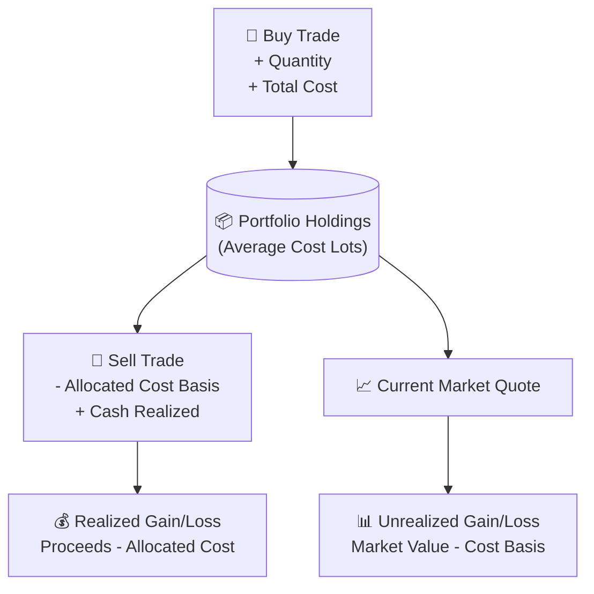
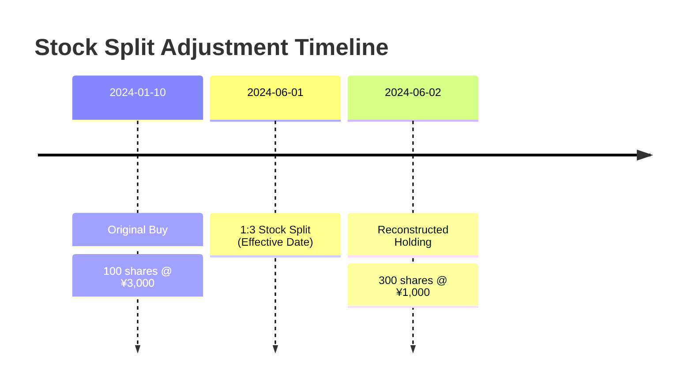

# Portfolio Calculation & Accounting Rules

Kabutora implements strict, deterministic financial mathematics using arbitrary-precision arithmetic (`Decimal.js`) to eliminate binary floating-point rounding errors.

---

## 1. Accounting Principles

### Key Rules:
1. **Precision**: All financial amounts, unit prices, and quantities are stored as strings and evaluated using 32-digit decimal precision with standard half-up rounding (`ROUND_HALF_UP`).
2. **Average Cost Basis Allocation**:
   - On **BUY** or **TRANSFER_IN**: Add lot quantity and acquisition cost to the account's holding balance.
   - On **SELL**: Calculate the prevailing weighted-average cost per share immediately prior to the sale. Allocate cost basis proportionally to determine realized gain/loss.
3. **Cash & Transfer Events**:
   - **`DEPOSIT` / `WITHDRAWAL`**: Increases or decreases portfolio cash balance.
   - **`TRANSFER_IN`**: Increases stock holding quantity and historical cost basis without altering cash accounts.
4. **Gain Calculations**:
   $$\text{Realized Gain} = \text{Gross Sale Proceeds} - \text{Allocated Cost Basis}$$
   $$\text{Unrealized Gain} = \text{Current Market Value} - \text{Remaining Cost Basis}$$
   $$\text{Total Gain} = \text{Realized Gain} + \text{Unrealized Gain}$$

---

## 2. Corporate Actions (Stock Splits & Reverse Splits)

Kabutora does **not** destructively rewrite original trade rows when a stock split occurs. Instead, splits are applied non-destructively as point-in-time timeline events:

- **Split Ratio Factor**: $f = \frac{\text{Numerator}}{\text{Denominator}}$ (e.g., 3:1 split has $f = 3$)
- **Adjusted Quantity**: $\text{Quantity}_{\text{adjusted}} = \text{Quantity}_{\text{orig}} \times f$
- **Adjusted Price**: $\text{Price}_{\text{adjusted}} = \text{Price}_{\text{orig}} \div f$
- Total capital invested and cost basis remain constant across splits.

---

## 3. Multi-Currency & Asset Types

| Asset Class | Valuation Unit | Pricing Basis | FX Conversion |
|---|---|---|---|
| **Japanese Equities** | 1 Share | TSE Yen Price | None (Native JPY) |
| **US Equities** | 1 Share | USD Market Price | Converted via historical USD/JPY rate on trade date, or live FX rate for current market value |
| **Mutual Funds (投資信託)** | 1 Unit (口) | NAV per 10,000 units | $\text{Value} = \frac{\text{Quantity} \times \text{NAV}}{10,000}$ |

