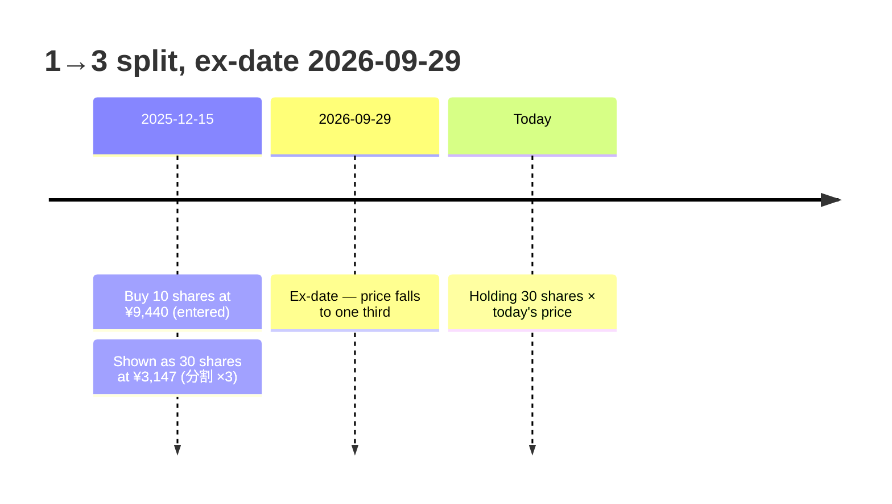

# Portfolio Calculation Rules

All portfolio arithmetic lives in [`packages/domain/src/portfolio.ts`](../packages/domain/src/portfolio.ts). The browser calls it through [`use-portfolio.ts`](../apps/web/components/dashboard/use-portfolio.ts); views only format its output. Money uses float64 and is rounded only for display. Quantities below 1e-9 are treated as zero.

---

## 1. Stock splits: one multiplier per trade

Yahoo publishes daily closes **already adjusted for every split** (in today's share units) and lists the splits in the same response. Kabutora stores both together as one `DailyHistory` record per security and converts every trade once:

```
factor(tradeDate) = product of split ratios with ex-date > tradeDate
quantity_today    = quantity_entered × factor
price_today       = price_entered ÷ factor        (the cash amount never changes)
```

A trade on or after the ex-date is already in post-split units (factor 1). Because quantities and closes share one unit, a portfolio value on any past date is simply `quantity_today × close`, the current value uses today's quote, and nothing changes on the split date except the price per share.



Rules that keep this correct:

- A split is never a timeline event and is never "applied" to holdings, so it cannot be applied twice.
- Split lists are never merged across sources (no seed files, no browser cache unions). The market backend replaces a record whenever Yahoo re-adjusts its closes (a new split or a data correction); see [market backend](market-backend.md).
- Market data is looked up through `marketKey(securityId)`, so `sec-285a-xtks`, `sec-285a` and `285A.T` all read the same record. Ledger ids are never rewritten.
- The activity ledger shows today's units with a `分割 ×N` badge; the entered values remain in the transaction and in the editor.

## 2. Positions: moving average (移動平均法)

Per security and cost-basis group (broker + account type, e.g. NISA and 特定 are separate):

| Event | Effect |
|---|---|
| BUY / TRANSFER_IN | quantity += q; cost += amount |
| SELL | sold = min(q, quantity); allocated = cost × sold / quantity; realized += proceeds × sold / q − allocated; quantity −= sold; cost −= allocated |

A sale larger than the holding is clamped and reported (`book.issues`, Settings → 取引データ, `保有数超過` in the ledger).

```
Unrealized = market value − cost basis (open positions)
Realized   = Σ sale gains + dividends received
Total gain = unrealized + realized;  total return = total gain ÷ cost basis
```

## 3. Currencies

| Amount | USD/JPY used |
|---|---|
| Trade cost and proceeds | Daily close on the trade date (the latest close on or before it) |
| Market value | Live rate |
| Previous close (day change) | Previous-close rate |
| Dividend | Rate on the recognition date |
| Historical value on date d | Close on date d |

Only JPY↔USD is converted. When USD/JPY is unavailable, converted totals exclude the affected amounts and the overview says so.

## 4. Day change

For each holding, with the session date taken in the exchange's time zone (PTS night trades after midnight belong to the previous date):

```
day gain = value now − (units held before the session × previous close) − (cash invested in the session)
```

Shares bought today count from their purchase price, not yesterday's close. The previous close is the daily close before the session date (split-adjusted); the quote's own previous close is used only when history is missing, corrected if a split takes effect that day.

## 5. Dividends

Units held per account at the end of the day **before** each ex-date (today's units) × the per-unit amount (today's units; per 10,000 units for Japanese funds), recognized on the payment date when known, otherwise the ex-date. When Yahoo reports a dividend on the same date as a split, the backend decides from the neighbouring dividends whether the amount is still per pre-split share.

## 6. History charts

- **1M–ALL:** one point per trading day from the first included trade; values use split-adjusted closes, carried forward over holidays; before a security's first close the last execution price is used. The last point uses live quotes and equals the overview total.
- **1D / 1W:** 15-minute series for the held securities (plus Japannext PTS observations after the TSE close), with the quantity held on each point's date, ending at the live total.

## 7. Japanese mutual funds

NAV is quoted per 10,000 units: `value = units × NAV ÷ 10,000`, and distributions are per 10,000 units.
