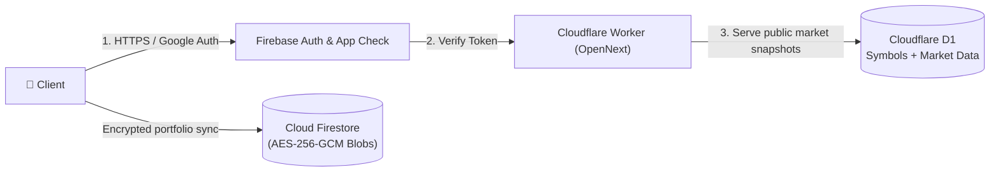
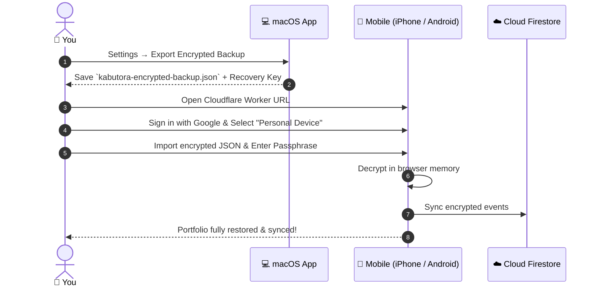

# Cloud Deployment & Infrastructure Guide

Kabutora is deployed globally on **Cloudflare Workers** (edge compute & market proxy) and uses **Firebase** (Google Authentication, App Check, and Cloud Firestore for ciphertext storage).

Market JSON requests run directly in the existing Worker, using the same authenticated route handlers as local Next.js development. Keep this path on Workers Free: quote/benchmark queue jobs prepare full and compact snapshot responses in `market_response_cache`, so HTTP requests do not repeatedly reconcile chart histories. Apply `0006_market_response_cache.sql` and `0007_market_pts_indexes.sql` with the existing D1 migrations before deploying this path. Indexes and bounded public-catalog reads reduce billed D1 rows; monitor the daily free allowance rather than assuming the workload always fits. Missing prepared snapshots return HTTP 503 with a retry delay; HTTP snapshot reads do not call providers. Never disable authentication or App Check to reduce CPU use.

Prepared payloads use a `gzip:`-prefixed base64 representation in the existing cache column; readers still accept legacy JSON rows. Compression happens in queue jobs, and HTTP responses stream decompression with a current clock/session prefix. Cloud manual refresh enqueues quotes, polls compact snapshots, and reports a pending or free-allowance-limited result honestly. History and dividend recovery run separately; history requests use a two-request client pool. Imported Firebase public keys are reused until certificate rotation, while every request still verifies its token.

The refresh endpoint checks the existing daily budgets and sends one public-symbol-only dispatch message. The queue consumer reconciles the registry, claims bounded quote/benchmark jobs, and counts the dispatch against the same free message allowance. This keeps registry writes and scheduling bookkeeping out of the HTTP CPU budget.

---

The replacement public-market backend uses coordinated client/server `v2` flags, one shared SQLite coordinator, immutable public chunks and one minute Cron. The introductory prepared-snapshot/Queue description applies to the legacy compatibility path. See the [implementation record](backend-overhaul-implementation.md) and [operations runbook](backend-operations.md) for actual release evidence and rollback. Verified recovery enrollment is enabled; existing private data is never migrated by deployment.

## 1. Architecture Flow



---

## 2. Step-by-Step Setup

### Step 1: Firebase Project Setup
1. Create a Firebase project in the [Firebase Console](https://console.firebase.google.com/).
2. Enable **Authentication** with Google Sign-In.
3. Enable **Cloud Firestore** in Production mode.
4. Enable **reCAPTCHA Enterprise App Check** (or reCAPTCHA v3) for your web app:
   - In Firebase Console > App Check > Apps, register your web app with **reCAPTCHA Enterprise** (recommended) or **reCAPTCHA v3**.
   - Copy the generated site key to `NEXT_PUBLIC_FIREBASE_APP_CHECK_SITE_KEY` in `apps/web/.env.production.local`.
   - Set `NEXT_PUBLIC_FIREBASE_APP_CHECK_PROVIDER` to `enterprise` or `v3` (the backward-compatible default), matching the provider registered in **Firebase App Check**. A key managed in Google Cloud reCAPTCHA does not by itself mean the App Check Enterprise exchange is configured. The existing production app uses the v3 registration.
   - Verify your production domain (and any preview domains) are added to the allowed domains list in Google Cloud Console (under **Security > Fraud Defense > reCAPTCHA**).
5. Deploy Firestore security rules and composite indexes:
   ```bash
   npx firebase-tools deploy --only firestore
   ```

### Step 2: Authorize Your User ID
1. Sign in once with your Google account.
2. Note your Firebase User UID from the Authentication tab.
3. In Firestore console, create an authorization document at `appAccess/{YOUR_UID}`.

### Step 3: Configure Cloudflare Secrets
Set your Firebase project secrets in Wrangler:
```bash
npx wrangler secret put FIREBASE_PROJECT_ID
npx wrangler secret put FIREBASE_PROJECT_NUMBER
npx wrangler secret put FIREBASE_WEB_APP_ID
npx wrangler secret put KABUTORA_ALLOWED_UID
```

### Step 4: Deploy the Cloudflare Worker
Create the existing Worker's market resources once, apply migrations, then deploy the OpenNext application:
```bash
node node_modules/wrangler/bin/wrangler.js d1 create kabutora-market
node node_modules/wrangler/bin/wrangler.js queues create kabutora-market-refresh
node node_modules/wrangler/bin/wrangler.js d1 migrations apply kabutora-market --remote
pnpm --filter @kabutora/web deploy:cloudflare
```

Record the D1 `database_id` returned by the create command in `apps/web/wrangler.jsonc`. The same `kabutora` Worker owns the Cron trigger, Queue producer/consumer, and D1 binding; do not create a separate website project.

---

## 3. Initial Migration from Local to Cloud



---

## 4. Verification Checklist

- [ ] Production URL returns `HTTP 200` with strict Content Security Policy headers.
- [ ] Unauthenticated API requests to `/api/market/*` return `HTTP 401 Unauthorized`.
- [ ] Authenticated requests from authorized Google UID return live quotes with `HTTP 200`.
- [ ] App Check tokens are actively generated and verified (`X-Firebase-AppCheck`), and reCAPTCHA assessment traffic appears in Google Cloud / Firebase Console.
- [ ] Firestore contains only encrypted ciphertext blobs (no plaintext ticker symbols or quantities).
- [ ] D1 contains public security IDs and market values only; its schema has no transaction, account, quantity, cost-basis, balance, or portfolio fields.
- [ ] The `* * * * *` coordinator watchdog is attached to the existing `kabutora` Worker. V2 owns acquisition; the old Queue consumer only drains compatibility messages until retirement is verified.
- [ ] Migration `0005_japannext_pts_frames.sql` is applied before deploying the Worker code.
