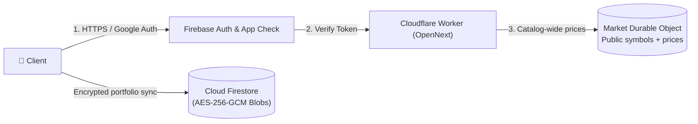
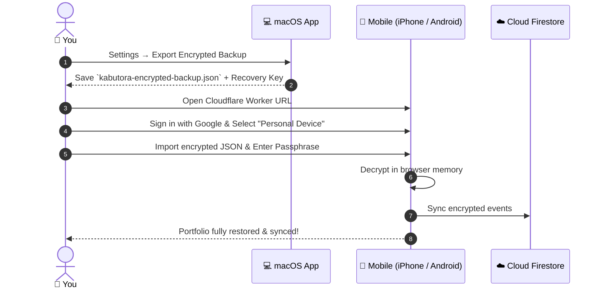

# Cloud Deployment & Infrastructure Guide

Market requests run in the existing Worker: an authenticated router forwards `/api/market/*` to one `MarketCoordinator` Durable Object, which refreshes catalog-wide prices on read and serves warm data from memory. See [Market backend](market-backend.md). Never disable authentication or App Check to reduce CPU use.

---

## 1. Architecture Flow



---

## 2. Step-by-Step Setup

### Step 1: Firebase Project Setup
1. Create a Firebase project in the [Firebase Console](https://console.firebase.google.com/).
2. Enable **Authentication** with Google Sign-In.
3. Enable **Cloud Firestore** in Production mode.
4. Enable **reCAPTCHA Enterprise App Check** (or reCAPTCHA v3) for your web app:
   - In Firebase Console > App Check > Apps, register your web app with **reCAPTCHA Enterprise** (recommended) or **reCAPTCHA v3**.
   - Copy the generated site key to `NEXT_PUBLIC_FIREBASE_APP_CHECK_SITE_KEY` in `apps/web/.env.production.local`.
   - Set `NEXT_PUBLIC_FIREBASE_APP_CHECK_PROVIDER` to `enterprise` or `v3` (the backward-compatible default), matching the provider registered in **Firebase App Check**. A key managed in Google Cloud reCAPTCHA does not by itself mean the App Check Enterprise exchange is configured. The existing production app uses the v3 registration.
   - Verify your production domain (and any preview domains) are added to the allowed domains list in Google Cloud Console (under **Security > Fraud Defense > reCAPTCHA**).
5. Deploy Firestore security rules and composite indexes:
   ```bash
   npx firebase-tools deploy --only firestore
   ```

### Step 2: Authorize Your User ID
1. Sign in once with your Google account.
2. Note your Firebase User UID from the Authentication tab.
3. In Firestore console, create an authorization document at `appAccess/{YOUR_UID}`.

### Step 3: Configure Cloudflare Secrets
Set your Firebase project secrets in Wrangler:
```bash
npx wrangler secret put FIREBASE_PROJECT_ID
npx wrangler secret put FIREBASE_PROJECT_NUMBER
npx wrangler secret put FIREBASE_WEB_APP_ID
npx wrangler secret put KABUTORA_ALLOWED_UID
```

### Step 4: Deploy the Cloudflare Worker
Deploy the OpenNext application to the existing Worker, then verify it:
```bash
pnpm --filter @kabutora/web deploy:cloudflare
pnpm verify:prod
```

The `kabutora` Worker owns the `MarketCoordinator` Durable Object and the one-minute Cron trigger; no D1 migration or Queue is required. The legacy `kabutora-market` D1 binding is only read once to seed the symbol catalog. Do not create a separate website project.

---

## 3. Initial Migration from Local to Cloud



---

## 4. Verification Checklist

- [ ] Production URL returns `HTTP 200` with strict Content Security Policy headers.
- [ ] Unauthenticated API requests to `/api/market/*` return `HTTP 401 Unauthorized`.
- [ ] Authenticated requests from authorized Google UID return live quotes with `HTTP 200`.
- [ ] App Check tokens are actively generated and verified (`X-Firebase-AppCheck`), and reCAPTCHA assessment traffic appears in Google Cloud / Firebase Console.
- [ ] Firestore contains only encrypted ciphertext blobs (no plaintext ticker symbols or quantities).
- [ ] Market requests contain no holdings; the market object stores public symbols and prices only.
- [ ] The `* * * * *` Cron trigger is attached to the existing `kabutora` Worker (PTS frames and history warm-up).
- [ ] `pnpm verify:prod` passes: assets load, data routes require auth, `/api/market/health` reports fresh prices.
