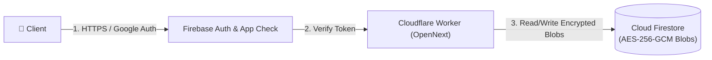
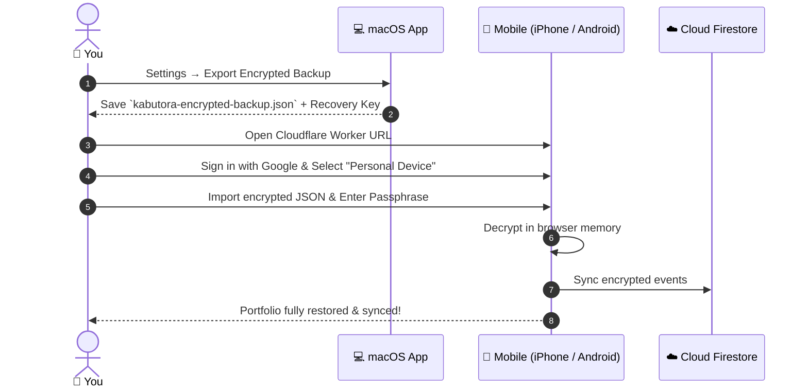

# Cloud Deployment & Infrastructure Guide

Kabutora is deployed globally on **Cloudflare Workers** (edge compute & market proxy) and uses **Firebase** (Google Authentication, App Check, and Cloud Firestore for ciphertext storage).

---

## 1. Architecture Flow



---

## 2. Step-by-Step Setup

### Step 1: Firebase Project Setup
1. Create a Firebase project in the [Firebase Console](https://console.firebase.google.com/).
2. Enable **Authentication** with Google Sign-In.
3. Enable **Cloud Firestore** in Production mode.
4. Enable **reCAPTCHA Enterprise App Check** for your web app.
5. Deploy Firestore security rules and composite indexes:
   ```bash
   npx firebase-tools deploy --only firestore
   ```

### Step 2: Authorize Your User ID
1. Sign in once with your Google account.
2. Note your Firebase User UID from the Authentication tab.
3. In Firestore console, create an authorization document at `appAccess/{YOUR_UID}`.

### Step 3: Configure Cloudflare Secrets
Set your Firebase project secrets in Wrangler:
```bash
npx wrangler secret put FIREBASE_PROJECT_ID
npx wrangler secret put FIREBASE_PROJECT_NUMBER
npx wrangler secret put FIREBASE_WEB_APP_ID
npx wrangler secret put KABUTORA_ALLOWED_UID
```

### Step 4: Deploy the Cloudflare Worker
Deploy the OpenNext application to Cloudflare Workers:
```bash
pnpm --filter @kabutora/web deploy:cloudflare
```

---

## 3. Initial Migration from Local to Cloud



---

## 4. Verification Checklist

- [ ] Production URL returns `HTTP 200` with strict Content Security Policy headers.
- [ ] Unauthenticated API requests to `/api/market/*` return `HTTP 401 Unauthorized`.
- [ ] Authenticated requests from authorized Google UID return live quotes with `HTTP 200`.
- [ ] Firestore contains only encrypted ciphertext blobs (no plaintext ticker symbols or quantities).

