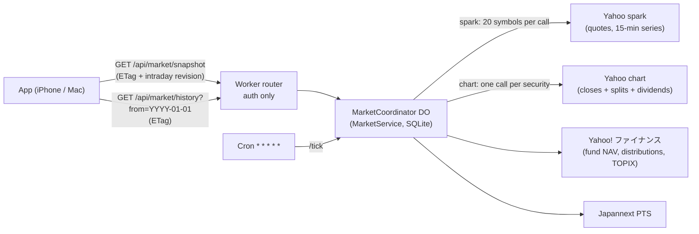

# Market backend

One Durable Object serves every market price the app shows. Opening the app makes one authenticated `snapshot` request (quotes, benchmarks, intraday series) and one `history` request (daily closes, splits and dividends), both for the whole shared catalog.

## Files

| File | Role |
|---|---|
| [`lib/server/market-upstream.ts`](../apps/web/lib/server/market-upstream.ts) | Provider adapters and parsers: spark quotes, chart history, funds, Monex, Japannext, TOPIX; subrequest `Budget` |
| [`lib/server/market-service.ts`](../apps/web/lib/server/market-service.ts) | Catalog, quote/intraday/fund/PTS refresh, daily-history records, HTTP surface (`serveMarket`) |
| [`lib/server/market-object.ts`](../apps/web/lib/server/market-object.ts) | Durable Object wrapper: SQLite key-value store, alarm continuation, cron tick |
| [`lib/server/market-router.ts`](../apps/web/lib/server/market-router.ts) | Worker routing: authentication, then the object (or search) |
| [`lib/server/market-search.ts`](../apps/web/lib/server/market-search.ts) | Security search (embedded catalogs, Yahoo, Yahoo! ファイナンス) |
| [`lib/market/market-wire.ts`](../apps/web/lib/market/market-wire.ts) | Wire format shared by edge and browser, with browser-side validation |
| [`lib/market/market-client.ts`](../apps/web/lib/market/market-client.ts) | The only browser transport; startup prefetch; cache keys |
| [`app/api/market/[resource]/route.ts`](../apps/web/app/api/market/[resource]/route.ts) | Same service in memory for the local Mac app and `next dev` |

## Daily-history records (why splits cannot drift)

Each security has one record: split-adjusted closes, the splits and the dividends **from the same Yahoo response**.

- First fetch: since 2010.
- Refresh (12 h, or after each session close, or when a quote moves >35% from the last close): fetch the last 14 days. If every overlapping close matches (±0.5%) and no new split appears, the new days are appended. Otherwise the whole record is refetched and replaced, because Yahoo re-adjusted its history.
- Funds append NAVs the same way; distributions are kept per date.
- Records are never merged with other sources, seed files or client caches. The browser receives them as-is and the engine derives every quantity from them (see [calculation rules](calculation-rules.md)).

## Freshness and cost

- Reads never wait for Yahoo while the quotes are under a minute old: the snapshot is answered from memory (≈5 ms in workerd) and a read older than 8 s starts one shared refresh behind the answer. A forced read (pull to refresh, 3 s) or older quotes (cold object, long idle) wait for the refresh. The cron also refreshes quotes every minute while anyone has read a snapshot in the last 15 minutes, so a reopened app gets recent quotes at once. When a snapshot's quotes are more than 10 s older than the answer, the browser reads once more 1.5 s later.
- 15-minute intraday series (5 days), fund NAVs (30 min), TOPIX (5 min) and Japannext (each minute, during PTS sessions) refresh in the background. A cold object waits for them at most 3 s once.
- The snapshot omits intraday series when the client already has the current revision, so a poll is a few kilobytes; unchanged snapshots and histories answer 304.
- Extended hours: a US pre-market or after-hours trade (from Yahoo's spark bars, `includePrePost`) becomes the quote with `regularPrice` = the regular-session price it moved from. After the TSE close, a Japannext trade made after it (day or night session, within ±20% of the TSE price) becomes the Japanese quote with `regularPrice` = the TSE close, and is appended to the intraday series. The UI shows the session (PTS / 時間外 / プレ) and the move from `regularPrice`; valuation uses the latest price.
- Japannext trades are tracked per security by cumulative volume: a volume change is a new trade, stamped with the file time. A night trade stays the quote into the next morning until a newer trade (or the TSE open) replaces it. A day-session trade first seen after the TSE close may predate it, so it counts only once its volume changes again. A file last written before the current session opened is ignored.
- Every invocation stays within Workers Free's **50 subrequests** (budget 45). History work that does not fit continues in a Durable Object alarm two seconds later.

The browser polls at the user's interval (10–60 s) while visible and any market is open, every 5 minutes when all markets are closed, and immediately when the app returns after 30 s. A reopened app paints the last snapshot and history from localStorage on the first frame.

## Privacy

Every member downloads the same catalog-wide data; holdings are filtered in the browser. Requests carry no symbol list, quantity, account or transaction date. History requests carry only the start of the earliest needed **year**. A cloud client adds a symbol to the catalog only when the user explicitly selects it in search (one id per request, enforced by the object). The catalog holds at most 200 public symbols and no user identifiers.

## Operations

- **Deploy:** `pnpm --filter @kabutora/web deploy:cloudflare`, then `pnpm verify:prod`.
- **Health:** `GET /api/market/health` (no auth, no symbols) returns quote and catalog counts and data age.
- **Storage:** the object keeps `catalog`, `q4` (last quotes), `h4:<key>` (history records) and `pts4` (Japannext series and latest trades) in SQLite. The first run of this version removes the previous backend's caches and keeps the catalog.
- **Rollback:** `wrangler rollback` to the previous Worker version; the previous version rebuilds its caches from upstream.

## What the checks prove

| Command | Proves |
|---|---|
| `pnpm check` | Types and unit contracts: split-consistent history records, basis-change replacement, same-day dividend normalization, shared refreshes, 304s, outage fallback, PTS overlay, fund NAVs, budgets, wire validation |
| `pnpm test:worker` | The real router + Durable Object in workerd with 80 ms upstream latency: auth denial, D1 catalog import, cold snapshot, warm read <150 ms, 304, 20 simultaneous refreshes → one upstream refresh, registry limits, history with splits, cron tick, restart during an outage |
| `pnpm exec playwright test` | UI on Chromium/WebKit, desktop/mobile, against the real wire format, including a split applied exactly once across views and refreshes |
| `pnpm test:cloud` | Encrypted multi-device flows; fails if a cloud market request contains a held symbol |
| `pnpm check:live` | Real Yahoo / Yahoo! ファイナンス providers still parse (needs network) |
| `pnpm verify:prod` | The deployed app: assets, auth, market latency and freshness |
