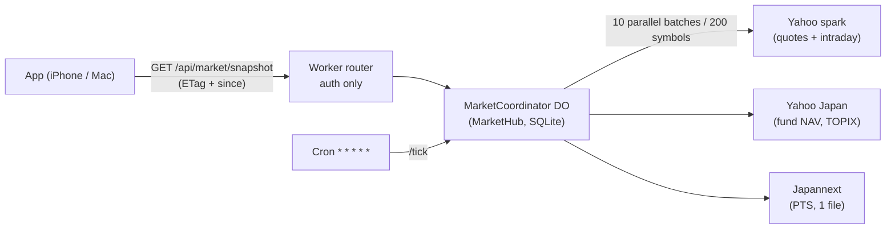

# Market backend

One Durable Object serves every market price the app shows. A phone opening the app makes **one** authenticated GET and receives quotes, benchmarks and five days of intraday charts for the whole shared catalog. There is no queue, no scheduler state machine, no D1 publication and no manifest/chunk protocol.

## Files

| File | Role |
|---|---|
| [`lib/server/market-sources.ts`](../apps/web/lib/server/market-sources.ts) | Upstream adapters: spark batching and quote rules, TOPIX, Japannext, funds, daily history |
| [`lib/server/market-hub.ts`](../apps/web/lib/server/market-hub.ts) | Catalog, snapshot cache and refresh, PTS frames, history/dividend stores, HTTP surface |
| [`lib/server/market-object.ts`](../apps/web/lib/server/market-object.ts) | Durable Object wrapper: SQLite store, one-time D1 catalog import, cron tick |
| [`lib/server/market-router.ts`](../apps/web/lib/server/market-router.ts) | Worker routing: authentication, then the object (or search) |
| [`app/api/market/[resource]/route.ts`](../apps/web/app/api/market/[resource]/route.ts) | Same hub in memory for the local Mac app and `next dev` |
| [`lib/market-client.ts`](../apps/web/lib/market-client.ts) | The only browser transport: shared request, ETag/`since`, saved-state restore |

## Freshness and cost

- A snapshot older than **15 s** (3 s for a manual refresh) is rebuilt on read. Concurrent readers share one rebuild. Warm reads are served from memory (≈5 ms in workerd).
- A rebuild's critical path is only Yahoo's `v7/finance/spark` endpoint: 20 symbols per call, run in parallel, 1-day/5-minute bars every rebuild and 5-day/15-minute bars every 30 minutes. 200 symbols = 11 calls (≈20 ms server time with warm connections).
- Fund NAV pages (30 min), TOPIX (5 min) and Japannext PTS (1 min) refresh in the background and never delay prices. A cold object waits for them at most 1.5 s once.
- After the TSE close, a newer Japannext trade (±20% sanity bound) becomes the Japanese price; the PTS chart comes from per-minute frames stored by the cron tick.
- Daily history (since 2000) and dividends are stored per symbol and per year in SQLite, refreshed every 12 h / 72 h by the cron tick, and served catalog-wide from the start of a requested year.
- Every invocation stays within Workers Free's **50 subrequests**: ≤23 for a 200-symbol snapshot, ≤36 per history/dividend request, ≤31 per tick.
- Load on Durable Objects (free plan) is about one request per app poll plus one tick per minute.

The client polls at the user's update interval while visible and refreshes immediately when the app returns to the foreground after 30 s. A reopened app restores the last revision from IndexedDB, so the first request usually returns 304 or a small delta.

## Privacy

Every member downloads the same catalog-wide snapshot; holdings are filtered in the browser. Requests carry no symbol list, quantity, account or transaction date. History requests carry only the start of the earliest needed **year**. A cloud client adds a symbol to the catalog only when the user explicitly selects it in search (one id per request, enforced by the object). The catalog holds at most 200 public symbols and no user identifiers.

## Operations

- **Deploy:** `pnpm --filter @kabutora/web deploy:cloudflare`, then `pnpm verify:prod`. That command checks the HTML, every frontend asset, auth on data routes, and `/api/market/health` latency and data age.
- **Health:** `GET /api/market/health` (no auth, no symbols) returns quote count and data age.
- **Rollback:** `wrangler rollback` to the previous Worker version. The old `public-market-v2` object instance clears itself the first time its leftover alarm fires.
- **Retired resources:** the `kabutora-market-refresh` Queue is unused (a no-op consumer drains it), and the `kabutora-market` D1 database is read once to seed the catalog. The owner can delete both after the first deploy has run.

## What the checks prove

| Command | Proves |
|---|---|
| `pnpm check` | Types, plus unit contracts: ≤25 upstream calls for 200 symbols, shared refreshes, zero calls when warm, payload budgets (full <1.5 MB, delta <150 KB), outage fallback, restart restore, PTS rules, HTTP/registry validation, history budgets |
| `pnpm test:worker` | The real router + Durable Object in workerd with 80 ms upstream latency: auth denial, D1 catalog import, 200-symbol refresh <2 s, warm read <150 ms, 304, 20 simultaneous refreshes → one upstream refresh, cron tick, restart during an outage |
| `pnpm exec playwright test` | UI on Chromium/WebKit, desktop/mobile, against the real wire format; `market-latency.spec.ts` requires one request and price on screen <2.5 s after it starts |
| `pnpm test:cloud` | Encrypted multi-device flows; fails if a cloud market request contains a held symbol |
| `pnpm check:live` | Real Yahoo/Yahoo Japan/fund providers still parse, with measured cold/warm latency (needs network) |
| `pnpm verify:prod` | The deployed app: assets, auth, market latency and freshness |
