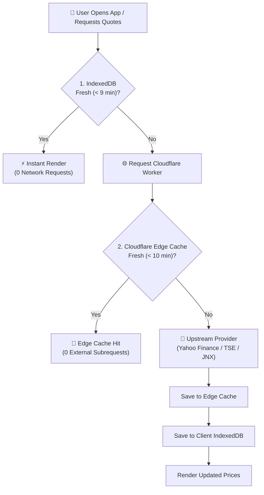

# Market Data Scaling & Edge Caching

Kabutora is engineered to deliver sub-50ms market data refresh speeds while operating comfortably within the **Cloudflare Workers Free tier** (100,000 requests/day).

---

## 1. Multi-Tier Caching Architecture

---

## 2. Request Budget & Rate Limiting

- **Batching**: Quotes are bundled into batches of **16 securities**. A portfolio with 200 tracked securities requires only 13 edge requests.
- **Smart Polling Frequencies**:
  - **Active Session (Tokyo / US Trading Hours)**: Automatic refresh defaults to 10–15 minute intervals.
  - **Closed Sessions / Off-Hours**: Refreshed at most once every 6 hours.
  - **Background / Inactive Tabs**: Polling automatically pauses when the browser tab is hidden.
- **Daily Request Estimate**:
  For an active investor running the app all day, expected usage is **~1,300 Worker requests/day**—well below Cloudflare's 100,000 requests/day free limit.

---

## 3. Fallback & Resiliency

| Scenario | System Behavior |
|---|---|
| **Temporary Upstream Outage** | Worker serves the most recent valid quote from the 7-day stale edge cache with a `STALE` status indicator. |
| **Intermittent Network Disconnect** | Client seamlessly renders existing holdings from IndexedDB with offline status badge. |
| **History Data Gaps** | Automatically detects missing daily bar holes (> 14 days) and triggers an incremental backfill request. |

