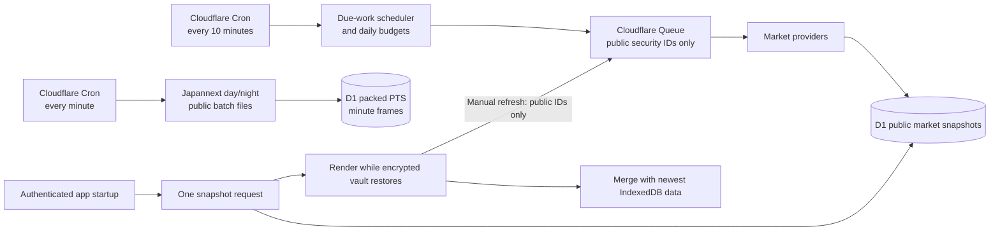

# Market Data Scaling & Server Snapshots

Kabutora keeps portfolio-private data client encrypted while allowing the Cloudflare server to know the public securities that need market updates. The server refreshes those securities without requiring the phone to stay open.

## Data flow

The D1 schema contains normalized symbols, venue/currency metadata, quotes, intraday bars, daily history, corporate actions, benchmarks, refresh metadata, and aggregate usage counts. It does not contain transactions, accounts, quantities, cost basis, balances, or portfolio identifiers.

## Refresh policy

- Stocks, indexes, FX, and global securities become due after fifteen minutes during an active session. Quote job claims use thirty-minute buckets, so an unchanged provider timestamp cannot cause a ten-minute retry loop.
- Closed-session quotes are refreshed at most every six hours.
- Fund NAVs and daily history are refreshed about once per day because upstream values do not change every few minutes. Distribution history has its own weekly schedule and is never fetched as a side effect of a daily price-history job.
- The phone's automatic refresh reads the server snapshot first. Manual refresh and pull-to-refresh enqueue public-symbol quote jobs, return immediately after acceptance, and merge completed batches through conditional snapshot reads.
- Price, daily-history, and distribution refreshes are independent. Daily history remains cache-first, while distributions can still be explicitly refreshed after a six-hour cooldown.
- The shared registry is additive. A client records the public symbols it recently used but cannot disable symbols registered by another account. The scheduler ignores registry entries not seen for thirty days.
- Security search remains an authenticated, query-time provider lookup. Search text is not written to D1. Requests are cancelled when superseded, exact Japanese codes use the Japanese provider only, and multi-provider searches have a bounded deadline.
- During Japannext's published operating windows, a separate one-minute Cron reads the public day (`pts_info_execution_J.js`) or night (`pts_info_execution_N.js`) batch. It parses assignment rows as inert JSON data, never executes the source, and retains only Japanese symbols already in the public registry.
- A frame records when the Worker observed the batch and separately records the upstream `Last-Modified` time. Unchanged, stale, malformed, oversized, and failed responses do not create invented points. Day and cross-midnight night frames share the appropriate Tokyo trading-date key.

## Batching and free-tier guardrails

- Browser-to-Worker live quote requests remain a local-mode or missing-data fallback. Cloud-mode refresh uses Queue jobs rather than browser fan-out.
- Queue quote jobs carry at most 20 public security IDs and fetch at concurrency two. History and distribution jobs remain limited to two IDs.
- Canonical and exchange-qualified aliases are collapsed into one provider fetch. A successful response can still populate both cache keys for compatibility.
- D1 upserts compare stable market values. Fetch timestamps and provider metadata alone do not rewrite quotes, intraday arrays, benchmarks, or decades of distribution events.
- Queue consumers run at concurrency two and retry at most once.
- A D1 daily-quota rejection is acknowledged instead of retried, preventing a queue backlog from stampeding the next UTC-day allowance.
- At most 1,600 Queue messages and 30,000 planned provider calls are admitted per UTC day. At three Queue operations per successful message, even one retry for every admitted message is capped at 9,600 operations.
- Scheduled jobs stop at a conservative estimate of 60,000 D1 row writes per UTC day, reserving 40,000 of the free allowance for indexes, registry pulses, metadata, and authenticated fallback requests. Distribution backfills are charged a deliberately high estimate and spill into later days when necessary.
- Queue and provider budgets are admission ceilings, not substitutes for D1 row-write control. The write-saving rules above prevent unchanged data and duplicate aliases from consuming the separate D1 daily allowance.
- PTS uses one packed row per observed minute across all registered Japanese symbols, plus one small source-state write. It does not write one D1 row per symbol. At 200 symbols the measured payload is about 6 KB per frame, or roughly 53 MB for seven days before database overhead, within the 500 MB D1 database allowance. The two daily writes per active minute remain far below the 100,000-row daily write allowance.
- The minute trigger adds 1,440 Worker invocations per day and at most one upstream subrequest per active minute. Together with the ten-minute scheduler, this remains far below the Workers free-plan 100,000-request daily allowance. Responses are conditionally fetched using `ETag` or `Last-Modified` when supplied.

If the budget is reached, the scheduler stops admitting lower-priority work rather than generating paid usage. Existing valid snapshots remain available with partial/stale status, and manual refresh reports that it was budget-limited instead of bypassing the guardrail.

## Startup behavior

After Firebase authentication, the app requests the market snapshot at the same time it subscribes to and decrypts the private vault. The dashboard merges server and IndexedDB values by `fetchedAt`, retains whichever value is newer, and does not block hydration while the server snapshot is still pending. Periodic and manual checks request the compact quote/benchmark snapshot without intraday arrays and use ETags to avoid retransmitting unchanged data. While the app is visible, it also requests cursor-based PTS increments in authenticated batches of at most 20 public security IDs. Server and browser caches cap each rendered session at 256 points while preserving its first, last, minimum, and maximum observations.
