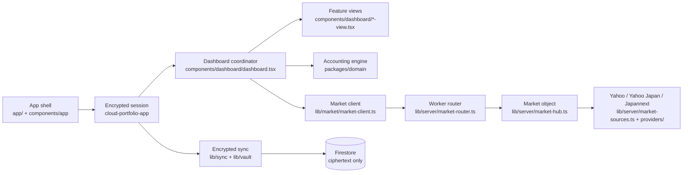

# Codebase Path Map

Use this map to find the owning module before searching the repository. Directory names state the
runtime boundary: everything under `apps/web/lib/server/` runs only in the Cloudflare Worker.

## Runtime flow



## Directory layout

```text
apps/web/
├── app/                       Next.js routes; app/api/market/[resource] serves the in-memory hub locally
├── components/
│   ├── app/                   bootstrap, error/loading shells, cloud session UI, browser-preferences provider
│   ├── dashboard/             dashboard coordinator, feature hooks, views and dialogs (see its AGENTS.md)
│   ├── watchlist/             watchlist view and search overlay
│   ├── search/                security search field + useSecuritySearch
│   └── charts/                canvas chart primitives (lightweight-charts.tsx) and their error boundary
├── lib/
│   ├── charts/                chart geometry, domain scaling, date/session presentation
│   ├── market/                market client (only transport), caches, catalogs, sessions, wire types (shared with edge)
│   ├── portfolio/             accounting adapters: domain worker, filters, notifications, FX, validation
│   ├── sync/                  encrypted Firestore sync, offline queue, event merges, Firebase client
│   ├── vault/                 vault encryption, KDF workers, trusted-device keys
│   ├── ui/                    gestures, page visibility, deadlines, recovery, display formatting
│   └── server/                EDGE ONLY — market hub/object/router/sources/search, auth
│       └── providers/         upstream page parsers (Yahoo, Yahoo Japan funds, Monex, Japannext, global search)
├── worker-entry.ts            Cloudflare Worker entry (fetch, cron tick, Durable Object export)
├── e2e/  cloud-e2e/           Playwright suites (local UI / encrypted multi-device)
└── runtime-tests/             real-Worker runtime checks run by `pnpm test:worker`
```

Tests sit beside their module as `<name>.test.ts`. File basenames are unique across the repo, so
searching by name is unambiguous.

## Where to make a change

| Change | Start here | Related code |
|---|---|---|
| Cost basis, holdings, splits, dividends | [`packages/domain/src/index.ts`](../packages/domain/src/index.ts) | [`index.test.ts`](../packages/domain/src/index.test.ts) |
| Shared market wire types | [`lib/market/market-api-types.ts`](../apps/web/lib/market/market-api-types.ts) | `packages/domain` `MarketQuote`, `IntradayBar` |
| Dashboard layout or wiring | [`components/dashboard/dashboard.tsx`](../apps/web/components/dashboard/dashboard.tsx) | `types.ts`, `constants.ts`, `helpers.ts` |
| A user preference | [`use-dashboard-preferences.ts`](../apps/web/components/dashboard/use-dashboard-preferences.ts) | `UserPreferences` in `types.ts`, `lib/sync/preference-event-merge.ts` |
| Market loading/refresh in the UI | [`use-market-loaders.ts`](../apps/web/components/dashboard/use-market-loaders.ts) | `use-market-state.ts`, `market-requirements.ts` |
| Valuation, FX, holdings, chart series | [`use-portfolio-view-model.ts`](../apps/web/components/dashboard/use-portfolio-view-model.ts) | `use-portfolio-history.ts`, `lib/portfolio/domain-worker*.ts` |
| One dashboard screen | `components/dashboard/*-view.tsx` | matching `apps/web/e2e/*.spec.ts` |
| Trade entry/edit, deletes | [`use-trade-editor.ts`](../apps/web/components/dashboard/use-trade-editor.ts) | `trade-modal.tsx`, `*-dialog.tsx` |
| Navigation, swipe, pull-to-refresh | [`use-view-navigation.ts`](../apps/web/components/dashboard/use-view-navigation.ts) | `use-touch-gestures.ts`, `lib/ui/touch-navigation.ts` |
| Watchlist/search UI | [`components/watchlist/watchlist-view.tsx`](../apps/web/components/watchlist/watchlist-view.tsx) | `components/search/*`, `lib/market/security-search.ts` |
| Styling | [`app/globals.css`](../apps/web/app/globals.css) | one stylesheet in cascade order; search for `SECTION: <name>` (table of contents at the top) |
| Chart rendering | [`components/charts/lightweight-charts.tsx`](../apps/web/components/charts/lightweight-charts.tsx) | `lib/charts/*`, `components/dashboard/charts.tsx` |
| Vault encryption and keys | [`lib/vault/vault-crypto.ts`](../apps/web/lib/vault/vault-crypto.ts) | `vault-kdf.ts`, `argon2-key.ts`, `trusted-device-key-store.ts` |
| Encrypted sync and replay | [`lib/sync/portfolio-session.ts`](../apps/web/lib/sync/portfolio-session.ts) | `portfolio-cloud-store.ts`, `portfolio-offline-queue.ts`, `*-event-merge.ts` |
| Client market transport/cache | [`lib/market/market-client.ts`](../apps/web/lib/market/market-client.ts) | `client-market-cache.ts`, `market-snapshot-merge.ts`, `intraday-cache.ts` |
| Market backend (snapshot, catalog, PTS, history) | [`lib/server/market-hub.ts`](../apps/web/lib/server/market-hub.ts) | [market backend](market-backend.md), `market-object.ts` (Durable Object), `market-router.ts`, `worker-entry.ts` |
| Provider parsing | [`lib/server/market-sources.ts`](../apps/web/lib/server/market-sources.ts) | `lib/server/providers/*` |
| Local/dev market route | [`app/api/market/[resource]/route.ts`](../apps/web/app/api/market/[resource]/route.ts) | in-memory `MarketHub`; Cloudflare uses the Worker router instead |
| Build/versioning | [`scripts/build-release.mjs`](../scripts/build-release.mjs) | `scripts/source-build-id.mjs`, `next.config.mjs`, `app/api/version/route.ts` |
| Privacy enforcement | [`scripts/verify-private-data-boundary.mjs`](../scripts/verify-private-data-boundary.mjs) | `check-client-boundary.mjs`, Firestore rules, threat model |

## Dependency boundaries

```text
components ────────> lib/{charts,market,portfolio,sync,vault,ui} ────> packages/domain
     └─X─> lib/server/

worker-entry / app/api/market ────> lib/server/ (market object) ────> upstream providers
```

- `packages/domain` is pure and depends only on `decimal.js`.
- Client code may import only *types* from `lib/server/`; `scripts/check-client-boundary.mjs` rejects any runtime import.
- `lib/market/` is shared: the edge imports its pure helpers (catalogs, sessions, history inspection) and wire types.
- Firestore receives encrypted vaults and encrypted events. The market object stores public market data and a catalog of at most 200 public symbols.

## Test routing

| Area | Fastest useful check |
|---|---|
| Domain math | `pnpm test:domain` |
| One module | `pnpm test <path/to/module.test.ts>` |
| Market server/provider code | `pnpm test:market`, then `pnpm test:worker` |
| Real providers still parse | `pnpm check:live` |
| Search UI | `pnpm test:e2e:search` |
| One UI spec | `pnpm exec playwright test apps/web/e2e/<spec>.spec.ts` |
| Firestore security rules | `pnpm test:rules` |
| Client/edge privacy | `pnpm verify:privacy` |
| All types and unit tests | `pnpm check` |
| Full browser matrix | `pnpm exec playwright test` |
