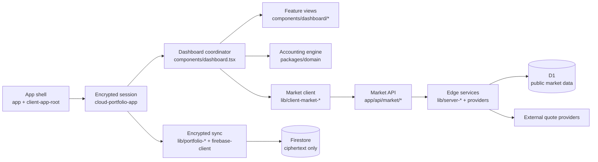

# Codebase Path Map

Use this map to find the owning module before searching the entire repository.

## Runtime flow



## Where to make a change

| Change | Start here | Related code |
|---|---|---|
| Cost basis, holdings, splits, dividends | [`packages/domain/src/index.ts`](../packages/domain/src/index.ts) | [`packages/domain/src/index.test.ts`](../packages/domain/src/index.test.ts) |
| Shared quote/provider types | [`packages/market-data/src/index.ts`](../packages/market-data/src/index.ts) | `apps/web/lib/server-market-types.ts` |
| Dashboard state or cross-view behavior | [`apps/web/components/dashboard.tsx`](../apps/web/components/dashboard.tsx) | `apps/web/components/dashboard/types.ts`, `helpers.ts`, `constants.ts` |
| One dashboard screen | [`apps/web/components/dashboard/`](../apps/web/components/dashboard) | nearest `*-view.tsx` and Playwright spec |
| Watchlist/search UI | [`apps/web/components/watchlist-view.tsx`](../apps/web/components/watchlist-view.tsx) | `use-security-search.ts`, `security-search-field.tsx`, `watchlist-search-overlay.tsx` |
| Chart rendering | [`apps/web/components/lightweight-charts.tsx`](../apps/web/components/lightweight-charts.tsx) | `lib/chart-geometry.ts`, `lib/chart-presentation.ts`, dashboard `charts.tsx` |
| Vault encryption and keys | [`apps/web/lib/vault-crypto.ts`](../apps/web/lib/vault-crypto.ts) | `vault-kdf.ts`, `argon2-key.ts`, `trusted-device-key-store.ts` |
| Encrypted sync and replay | [`apps/web/lib/portfolio-session.ts`](../apps/web/lib/portfolio-session.ts) | `portfolio-cloud-store.ts`, `portfolio-offline-queue.ts`, `*-event-merge.ts` |
| Client market loading/cache | [`apps/web/lib/client-market-service.ts`](../apps/web/lib/client-market-service.ts) | `client-market-cache.ts`, `market-snapshot-merge.ts` |
| Market API route | [`apps/web/app/api/market/`](../apps/web/app/api/market) | matching server service in `apps/web/lib` |
| Free-tier market request path | [`apps/web/lib/server-market-router.ts`](../apps/web/lib/server-market-router.ts) | `worker-entry.ts`, `server-market-request-context.ts`; reuses authenticated routes without Next.js request overhead |
| Prepared market snapshots | [`apps/web/lib/server-market-response-cache.ts`](../apps/web/lib/server-market-response-cache.ts) | queue jobs prepare full/compact public JSON; HTTP reads preserve ETags and a live server clock |
| Replacement public-market pipeline | [`apps/web/lib/server/market/coordinator.ts`](../apps/web/lib/server/market/coordinator.ts) | durable jobs, ingestion, observations, budgets and immutable publications; [rollout status](backend-overhaul-implementation.md) |
| Replacement public-market client | [`apps/web/lib/public-market-client.ts`](../apps/web/lib/public-market-client.ts) | common manifest/chunk reads, SHA-256 validation, selected history decoding; `public-chunk-cache.ts` stores public bytes separately |
| Backend operations | [`docs/backend-operations.md`](backend-operations.md) | status diagnostics, failure recovery, membership, rollback and compatibility retirement |
| D1 persistence | [`apps/web/lib/server-market-store.ts`](../apps/web/lib/server-market-store.ts) | `apps/web/migrations/` |
| Scheduled refresh | [`apps/web/lib/server-market-scheduler.ts`](../apps/web/lib/server-market-scheduler.ts) | `worker-entry.ts`, `server-market-provider.ts` |
| Provider parsing/fallback | [`apps/web/lib/server-market-provider.ts`](../apps/web/lib/server-market-provider.ts) | `yahoo-*`, `cnbc-quote-provider.ts`, `monex-foreign-fund.ts`, `japannext-pts.ts` |
| Build/versioning | [`scripts/build-release.mjs`](../scripts/build-release.mjs) | `scripts/source-build-id.mjs`, `next.config.mjs`, `app/api/version/route.ts` |
| Privacy enforcement | [`scripts/verify-private-data-boundary.mjs`](../scripts/verify-private-data-boundary.mjs) | `check-client-boundary.mjs`, Firestore rules, threat model |

## Dependency boundaries

```text
components ────────> client-safe lib ────────> packages/domain
     │                       │                packages/market-data
     └─X─> server-*          │
                             └─X─> Cloudflare bindings

app/api/market ────> server-* ────> D1 / queues / upstream providers
```

- `packages/domain` is pure and depends only on `decimal.js`.
- `packages/market-data` is a small shared schema/provider-contract package.
- Client components import direct client-safe leaf modules.
- Market route handlers import server leaf modules. The `lib/server/` barrel is for navigation and server-only use.
- Firestore receives encrypted vaults and encrypted events. D1 receives public market data only.

## Dashboard feature hierarchy

```text
components/
├── dashboard.tsx                 # coordinator: state, effects, navigation, data orchestration
└── dashboard/
    ├── types.ts                  # shared props and view models
    ├── constants.ts              # shared labels, ranges, and keys
    ├── helpers.ts                # shared pure presentation helpers
    ├── charts.tsx                # feature chart composition
    ├── overview-view.tsx
    ├── holdings-table.tsx
    ├── security-detail-view.tsx
    ├── activity-view.tsx
    ├── dividends-view.tsx
    ├── notifications-view.tsx
    ├── settings-view.tsx
    ├── trade-modal.tsx
    ├── delete-transaction-dialog.tsx
    └── remove-account-dialog.tsx
```

Keep shared dashboard object shapes in `types.ts`. Keep leaf-only props beside the leaf component.

## Test routing

| Area | Fastest useful check |
|---|---|
| Domain math | `pnpm test:domain` |
| One library module | `pnpm test <matching-test-file>` |
| Market server/provider code | `pnpm test:market` |
| Search UI | `pnpm test:e2e:search` |
| Holdings grid UI | `pnpm exec playwright test apps/web/e2e/holdings-grid.spec.ts` |
| Firestore security rules | `pnpm test:rules` |
| Client/edge privacy | `pnpm verify:privacy` |
| All types and unit tests | `pnpm check` |
| Full browser matrix | `pnpm exec playwright test` |
