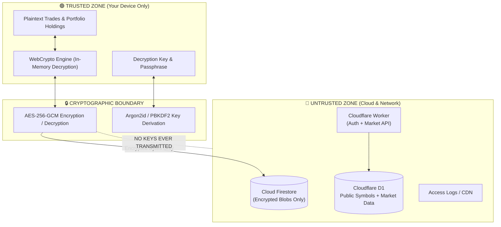

# Threat Model & Security Architecture

Kabutora uses a **zero-knowledge boundary for the financial ledger**. The threat model assumes that the cloud database or network could be monitored or breached: transactions, accounts, quantities, cost basis, balances, and encryption keys must remain private. Cloudflare is intentionally allowed to know the public symbols and venue metadata needed to refresh market prices.

---

## 1. Trust Boundaries & Security Model

---

## 2. Cryptographic Specifications

- **Cipher**: `AES-256-GCM`, with separate authenticated contexts for payloads, events, passphrase wrapping, recovery wrapping and the macOS local vault.
- **Key Derivation (KDF)**: `Argon2id` (64 MiB memory, 3 iterations, 1 lane) for passphrase wrapping. Browser workers keep key derivation off the UI thread. No weaker password KDF is substituted. Recovery keys use independently generated high-entropy wrapping material.
- **IV / Nonce**: Fresh cryptographically secure random 96-bit (12-byte) initialization vector generated for every encryption operation.
- **Revision and nonce rotation**: Snapshot modifications increment the revision and use a fresh IV. A vault-generation migration also generates a fresh AES key; changing an IV alone is not key rotation.
- **Trusted devices**: Google authenticates cloud access. A passphrase or recovery key enrolls each trusted device, which stores a non-extractable CryptoKey locally for automatic unlock. Shared devices retain keys and pending ciphertext only in memory.
- **Legacy migration**: Older releases stored a usable Google-account vault key in Firestore. Those existing vaults do not acquire zero-knowledge protection merely by installing the new client. Under a coordinated write lock, the client reconciles pending events, encrypts with a fresh key, verifies recovery locally, and atomically activates version 2 while deleting the server key. Necessary old keys remain only encrypted under the new generation. Obsolete writes are rejected; pending old-device edits are converted after recovery enrollment.
- **Interrupted migration**: After local recovery verification, trusted devices can retain an encrypted preparation and non-extractable key to resume activation. No passphrase or recovery secret is persisted by that mechanism.

---

## 3. Defense-in-Depth Protections

| Layer | Threat Vector | Mitigation Strategy |
|---|---|---|
| **Cloud Storage** | Database breach or unauthorized inspection | Firestore stores only encrypted portfolio payloads. D1 stores public security IDs/symbols and market data, but its schema rejects portfolio-private fields such as quantities, accounts, transactions, and cost basis. |
| **API Endpoints** | Unauthorized market scraping or API abuse | Cloudflare Workers verify Firebase ID Tokens and App Check tokens before serving quote data. |
| **Network & Logs** | Query sniffing in transit logs | Public symbol search queries and quote targets use HTTPS POST bodies instead of URL query parameters. The market server can read those public requests. Financial events have additional client-side encryption. URL invocation logs are disabled. |
| **Background Queue** | Private fields accidentally entering refresh jobs | Queue messages use a strict allowlist (`version`, job IDs/type, public `securityIds`, timestamp); messages with any extra field are acknowledged and discarded. |
| **Manual Refresh** | Portfolio fields accidentally entering an on-demand job | The authenticated endpoint accepts only a bounded `securityIds` array, normalizes it against the public security registry, and persists no user identifier or portfolio data. |
| **Search Privacy** | Search history revealing user intent | Search text exists only in the authenticated POST request and ephemeral Worker memory. It is never written to D1, Queue messages, URLs, or analytics. |
| **Browser Execution** | Cross-Site Scripting (XSS) / Injection | Strict Content Security Policy (CSP) with dynamic nonces on all HTML documents. Prerendered inline scripts are rejected. |
| **Local Storage** | Device theft or file extraction | macOS App uses Login Keychain for AES key storage. PWA uses non-extractable CryptoKey handles in IndexedDB on trusted devices. |

---

## 4. Operational Best Practices

1. **Keep Your Recovery Key Safe**: Store your offline recovery key in a password manager (e.g. 1Password, Bitwarden, Apple Keychain) or write it down.
2. **Shared vs. Trusted Device Mode**: When using a shared or public computer, always select "Shared Device" mode. In shared mode, data is held in browser memory only and immediately purged upon closing the tab.
3. **Enable 2FA**: Ensure your Google account is protected with two-factor authentication (passkeys or authenticator app).
