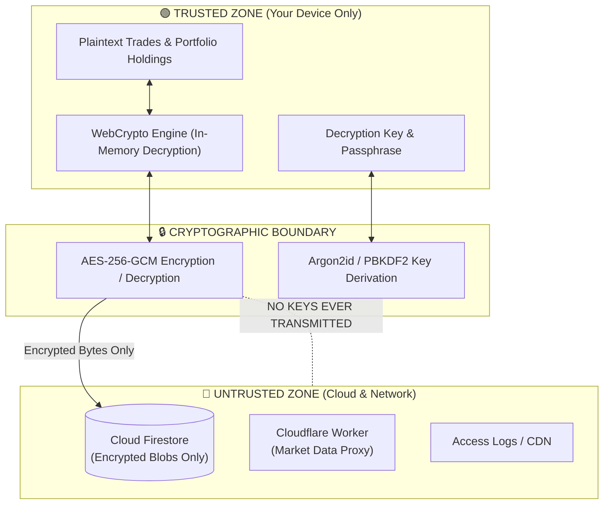

# Threat Model & Security Architecture

Kabutora is built with a **Zero-Knowledge Security Architecture**. The threat model assumes that the cloud database or network could be monitored or breached, yet user trade data and portfolio balances must remain completely private.

---

## 1. Trust Boundaries & Security Model

---

## 2. Cryptographic Specifications

- **Cipher**: `AES-256-GCM` with authenticating Additional Associated Data (AAD: `kabutora:local-vault:v1`).
- **Key Derivation (KDF)**: `Argon2id` (64 MiB memory, 3 iterations, 1 lane) for offline backup keys, with fallback to standard `PBKDF2-SHA256` (100,000+ iterations).
- **IV / Nonce**: Fresh cryptographically secure random 96-bit (12-byte) initialization vector generated for every encryption operation.
- **Key Rotation**: Every modification increments document revision, generates a new random IV, and creates fresh ciphertext.

---

## 3. Defense-in-Depth Protections

| Layer | Threat Vector | Mitigation Strategy |
|---|---|---|
| **Cloud Storage** | Database breach or unauthorized inspection | All Firestore records store only random encrypted payloads. Document IDs are random UUIDs; no ticker symbols or amounts are stored in plaintext. |
| **API Endpoints** | Unauthorized market scraping or API abuse | Cloudflare Workers verify Firebase ID Tokens and App Check tokens before serving quote data. |
| **Network & Logs** | Query sniffing in transit logs | Symbol search queries and quote targets are passed via encrypted POST body instead of URL query parameters. URL invocation logs are disabled. |
| **Browser Execution** | Cross-Site Scripting (XSS) / Injection | Strict Content Security Policy (CSP) with dynamic nonces on all HTML documents. Prerendered inline scripts are rejected. |
| **Local Storage** | Device theft or file extraction | macOS App uses Login Keychain for AES key storage. PWA uses non-extractable CryptoKey handles in IndexedDB on trusted devices. |

---

## 4. Operational Best Practices

1. **Keep Your Recovery Key Safe**: Store your offline recovery key in a password manager (e.g. 1Password, Bitwarden, Apple Keychain) or write it down.
2. **Shared vs. Trusted Device Mode**: When using a shared or public computer, always select "Shared Device" mode. In shared mode, data is held in browser memory only and immediately purged upon closing the tab.
3. **Enable 2FA**: Ensure your Google account is protected with two-factor authentication (passkeys or authenticator app).

